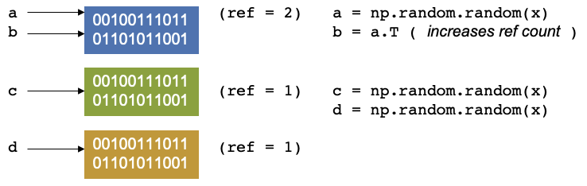

## Python and its applicability in HPC

Many of you, when you think of Python, think of the snake, but the origin of the name Python actually comes from the
very popular Monty Python series, starring John Cleese, Michael Palin and so on which was broadcasted in the 70s as a 
skit comedy show. It is also highly recommended viewing! The creators of the language really enjoyed the show, and they
named it after the show rather than the snake.

It is a high level objective oriented language as I am sure many of you know and ideal for rapid development. But if
you have an easy to use language, one that has simple syntax, has a thriving community and is versatile.

When one thinks of high performance computing, python shouldn't really be in the same sentence. Why? Because python, by
the way that the language actually works and is constructed.

Why do we use Python though? In short...

- It's simple
- Fully featured with basic data types, modules, error handling
- Easy to read
- Extensible in C, C++, Fortran
- Has a large community, third party libraries, tools
- Portable and free

This is all well and good, and working with Python is often a go to for day to day programmers. So what is the problem?
Shouldn't Python be the obvious choice for working on an HPC? 

You probably have guessed why, especially if you have been working with Python for a few months. It's slow!

All the above points as to why Python is such a great language to use does unfortunately impact on its performance.
Although Python is itself written in C under the hood, its dynamic nature and versatility causes it to be a poor
performer compared to other languages such as C and Fortran.

This course however, with the use of correct use of language, and reworking your code with other external libraries can
really assist in speeding up your code and more importantly, use it at scale.

First though, we will make sure you can log into ICHEC systems.

> ## Logging in
>
> Often one of the more complex items on the agenda is effectively logging in. We recommend having two terminal windows
> open for this. You have been given a course account in the form `courseXX` over the last few days, which you will 
> need to log in. If you are already an ICHEC user and are partaking in this course live, please use your course 
> account only.
> 
> You can log in using the following command
>
> ~~~
> $ ssh courseXX@kay.ichec.ie
> ~~~
> {: .language-bash}
>
> From here you will need the password for your ssh key (if you made one) followed by the course account password which
> will have been provided to you by your instructor. Once logged in we will then go into logging into ICHEC's 
> JupyterHub!
>
{: .challenge}

## Python's reference counting and garbage collector

Let us move onto reference counting and garbage collection. This is a very high level overview of the memory management
in Python. It is more complicated in reality, but this will give an overview to have a good idea of the governing
principles. 

Let’s consider the example where a script that starts by creating a random numpy array and assigning it to a variable 
`a`. In the background, you are creating a location in memory, that is continuous with some binary notation inside it. 
When you create somethin, Python will update the reference count. The reference refers to the number of variables that
point to the allotted location in memory. The reference is not to the variable, but to the location. If you have worked
with C, C++ this concept should be fairly familiar. 

Now let's create another operation and continue in the script, say you create a transpose of `a` and assign it to `b`,
it doesn’t create new memory. Instead, the operation does some changes and reuses the same block of memory, as it is 
used by two variables, and the reference counter will increase by 1. 

Let us continue our script again. We create have two other arrays, `c` and `d`, let us keep them the same size, our 
reference counters will be 1 and 1. 

Now let us say we delete `c`, Our reference counter decreases as there is no variables that point to that block of 
memory. The memory location has no variable pointing to it. There is another concept called *garbage collection* which
are cycles that occur in Python. It is a mechanism that checks through the memory and when it finds that a memory
location has a reference equal to 0, then the garbage collector will mark it as free. But the memory appears as free to
Python, but not to anything outside of Python. You effecitvely see it as a black box and so does the operating system. 
Python however, sees it as an empty black box it can use. If you create a new variable, it may put it into this space 
in memory. You can also reduce the reference count by setting `c = 1`, so that it now points somewhere else. 

Continuing with our script, if we allocate an array, `e` of `size = y`, where `y > x`, then the memory doesn’t fit, and 
unlike a gas being able to become pressurised as it fits into a small container, we cannot fit this in in the same way 
as we cannot fit a litre of water in a teacup. 

The memory of NumPy arrays is allocated as a continuous block only. So the block will be unused and will only be used
if you create something later that fits in the memory. If that happens Python can allocate the memory, reuse it and set
the reference counter to 1 again. 

It will only be used up if you create a new item (which we will call `f`) which fits that memory space, then python can
allocate, reuse the memory then set the reference to 1 again.

It gets more complex if we decide to parallelise this, For threading, which is splitting up a simple process like
this into separate pieces. A thread can be thought of like a hand on a keyboard, your hand being the process, it splits
up to complete the small tasks of pushing different keys. When it comes to a problem like this, if the reference
counting is different between two different threads it can cause conflicts, as they are trying to access the same 
memory at the same time and therefore control the reference.

The garbage collector may then find that something was set to 0, and it was not supposed to be, then the rest of the
program is expecting to access this memory, but has already disappeared, or it was supposed to be free and two threads
corrupted the reference counting, which can result in leaking memory, or the program may use more memory and then crash
or return peculiar results.

> ## Connecting to JupyterHub
> 
> Now to connect to the Jupyter notebooks we will need to set up an ssh tunnel
>
> ~~~
> $ module load conda/2
> $ source activate jupyterhub
> $ jupyterhub_kay
> ~~~
> {: .language-bash}
>
> After typing these few lines, it it will print some instructions to create and use a SSH tunnel. For example, you may
> see some output similar to the following.
> 
> ~~~
> JupyterHub starting (will take 1-2min). Usage instructions will be printed soon.
> 
> Usage Instructions:
> 1. Create a ssh tunnel from your local computer using the command
> ssh -N -L 8080:localhost:12345 courseXX@login2.kay.ichec.ie
> 2. Open web browser at http://localhost:8080
> ~~~
> {: .output}
>
> From this point you should head over to your other terminal window, which does not have a connection to ICHEC's 
> cluster and type the first line from from the instructions.
>
> You will be requested a password after successful entry, the window will not show any output. You can then head to a
> web browser, ideally Chrome or Firefox and enter the link in the second step of the isntructions.
>
{: .challenge}


