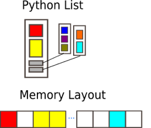

## Performance Measurement

Before diving into methods to speed up a code, we need to look at some tools which can help us understand how long our
code actually takes to run. This is the most fundamental tool and one of the most important processes that one has to
go through as a programmer.

Performance code profiling is a tool used to identify and analyse the execution of applications, and identify the 
segments of code that can be improved to achieve a better speed of the calculations or a better flow of information and
memory usage.

This form of dynamic program analysis can provide information on several aspects of program optimization, such as:
- how long a method/routine takes to execute
- how often a routine is called
- how memory allocations and garbage collections are tracked
- how often web services are called

It is important to never try and optimise your code on the first try. Get the code correct first. It is often said that
premature optimization is the root of all evil when it comes to programming.

Before optimising a code, one needs to find out where the time is spent most. Around 90% of the time is spent in 10% of
the application.

There are a number of different methods and modules one can use
- `time`
- `timeit`
- `cProfile`
- `datetime`
- `astropy` - mainly for astronomy usage
- Full fledged profiling tools: TAU, Intel Vtune, Python Tools for Visual Studio, etc.

### `time` module

Python's time module can be used for measuring time spent in specific part of the program. It can give the absolute 
real-world time measured from a fixed point in the past using `time.time()`. Additionally, `time.perf_counter()` and
`time.process_time()` can be used to derive the relative time. unit-less value which is proportional to the time 
elapsed between two instants.

~~~
import time

print (time.time())

print (time.perf_counter()) # includes time elapsed during sleep (CPU counter)
print (time.process_time()) # does not include time elapsed during sleep
~~~
{: .language-python}

~~~
1652264171.399796
2.433484803
0.885057
~~~
{: .output}

It's main use though is to take the `time.time()` function and assign it to a variable, then have the function which
you want to time, followed by a second call of the `time.time()` function and assign it to the new variable. A quick
arithmetic operation will quickly deduce the length of time taken for a specific function to run.

~~~
t0 = time.time()

my_list = []
for i in range(500): 
    my_list.append(0)
    
t1 = time.time()

tf = t1-t0

print('Time taken in for loop: ', tf)
~~~
{: .language-python}

~~~
Time taken in for loop:  0.00011992454528808594
~~~
{: .output}

### `timeit` module

This can be particularly useful as it can work in both python files and most importantly in the command line interface.
Although it can be used in both, it's use is excellent in the command line. The `timeit` module provides easy timing
for small bits of Python code, whilst also avoiding the common pitfalls in measuring execution times. The syntax from
the command line is as follows:

~~~
$ python -m timeit -s "from my module import func" "func()"
~~~
{: .language-bash}

~~~
10 loops, best of 3: 433 msec per loop
~~~
{: .output}

In a Python interface such as iPython, one can use magics (`%`).

~~~
In [1]: from mymodule import func
In [2]: %timeit func()
~~~
{: .language-bash}

~~~
10 loops, best of 3: 433 msec per loop
~~~
{: .output}

Let us look at an example using the Montecarlo technique to estimate the value of pi.

~~~
import random as rnd
import math

def montecarlo_py(n):
    x, y = [], []
    for i in range(n):
        x.append(rnd.random())
        y.append(rnd.random())
    pi_xy = [(x[i], y[i]) for i in range(n) if math.sqrt(x[i] ** 2 + y[i] ** 2) <= 1]
    return(4 * len(pi_xy) / len(x))
    # Estimate for pi
~~~
{: .language-python}

Our modules `math`, `random` are imported for the calculation, and the function returns an estimate for pi given `n`
number of points. Running the program can be done as so, and will produce a result close to `3.14`.

~~~
montecarlo_py(1000000)
~~~
{: .language-python}

If we want to time this using `timeit` we can modify the above statement using cell magics, and it will not produce the
result, but rather the average duration

~~~
%timeit montecarlo_py(1000000)
~~~
{: .language-python}

~~~
724 ms ± 6.52 ms per loop (mean ± std. dev. of 7 runs, 1 loop each)
~~~
{: .output}

You can implement a more controlled setup, where one sets the number of iterations, repetitions, etc, subject to the
use case.

~~~
import timeit

setup_code = "from __main__ import montecarlo_py"
stmt = "montecarlo_py(1000000)"
times = timeit.repeat(setup=setup_code, stmt=stmt, repeat=3, number=10)
print(f"Minimum execution time: {min(times)}")
~~~
{: .language-python}

~~~
Minimum execution time: 7.153229266
~~~
{: .output}

### `cProfile`

cProfile provides an API for profiling your Python program
A profile is a set of stats
Time spent in different parts of the program

~~~
# profile statement and save results to a file func.prof
cProfile.run('func()', 'func.prof')
~~~
{: .language-bash}

~~~
import cProfile
cProfile.run('montecarlo_py(1000000)')
~~~
{: .language-python}

~~~
         5000007 function calls in 1.391 seconds

   Ordered by: standard name

   ncalls  tottime  percall  cumtime  percall filename:lineno(function)
        1    0.495    0.495    0.558    0.558 <ipython-input-3-7987cc796f5a>:11(<listcomp>)
        1    0.501    0.501    1.338    1.338 <ipython-input-3-7987cc796f5a>:6(montecarlo_py)
        1    0.053    0.053    1.391    1.391 <string>:1(<module>)
        1    0.000    0.000    1.391    1.391 {built-in method builtins.exec}
        2    0.000    0.000    0.000    0.000 {built-in method builtins.len}
  1000000    0.063    0.000    0.063    0.000 {built-in method math.sqrt}
  2000000    0.128    0.000    0.128    0.000 {method 'append' of 'list' objects}
        1    0.000    0.000    0.000    0.000 {method 'disable' of '_lsprof.Profiler' objects}
  2000000    0.150    0.000    0.150    0.000 {method 'random' of '_random.Random' objects}

~~~
{: .output}

This can be modified to save the output to a .prof file.

~~~
cProfile.run('func()', 'func.prof')
~~~
{: .language-python}

But there is not much point of this for a small function like this which has a limited runtime. We will look at another file, and this time run it through the terminal, and generate the `.prof` file.

~~~
python -m cProfile -o heat_equation_simple.prof heat_equation_simple.py
~~~
{: .language-bash}

~~~
Running Time: 20.20987105369568
~~~
{: .output}

We need a separate module to look at the profile we have just created.

### Investigatinf profiles with `pstats`

* Prints execution time of selected functions. 
* Sorts by function name, time, cumulative time, ... 
* Python module interface and interactive browser

~~~
from pstats import Stats
p = Stats('heat_equation_simple.prof')

p.strip_dirs() #The strip_dirs() method removes the extraneous path from all the module names

# Other string options include 'cumulative', 'name', 'ncalls'
p.sort_stats('time').print_stats(10)
~~~
{: .language-python}

~~~
Day Month Date HH:MM:SS Year    heat_equation_simple.prof

         1007265 function calls (988402 primitive calls) in 22.701 seconds

   Ordered by: internal time
   List reduced from 5896 to 10 due to restriction <10>

   ncalls  tottime  percall  cumtime  percall filename:lineno(function)
      200   20.209    0.101   20.209    0.101 evolve.py:1(evolve)
      797    0.841    0.001    0.841    0.001 {built-in method io.open_code}
    68/66    0.178    0.003    0.183    0.003 {built-in method _imp.create_dynamic}
        1    0.135    0.135    0.135    0.135 {built-in method mkl._py_mkl_service.get_version}
      797    0.128    0.000    0.128    0.000 {built-in method marshal.loads}
      797    0.118    0.000    0.118    0.000 {method 'read' of '_io.BufferedReader' objects}
     3692    0.059    0.000    0.059    0.000 {built-in method posix.stat}
      797    0.043    0.000    1.002    0.001 <frozen importlib._bootstrap_external>:969(get_data)
 2528/979    0.038    0.000    1.107    0.001 {built-in method builtins.__build_class__}
       36    0.035    0.001    0.035    0.001 {built-in method io.open}
~~~
{: .output}

Using this for longer programs and more functions can help you pin down the functions in your code which need optimisation.

Using pstats in the terminal

~~~
$ python -m pstats myprof.prof
Welcome to the profile statistics
% strip
% sort time
% stats 5

Day Month Date HH:MM:SS Year my.prof
...
~~~
{: .language-bash}

> ## Montecarlo Pi
>
> There are three functions in the code block below. Each is a slightly different implementation of a Montecarlo algorithm for calculating the value of pi. Use time.time(), %timeit, cProfile and pstats to learn how the functions work. Are the timings what you would expect? What implementation is fastest for 1 million points?
>
>
> `pi_estimation_pure()` is a pure Python implementation using lists
> 
> `pi_estimation_loop()` uses numpy arrays to replace the python lists.
> 
> `pi_estimation_np() uses numpy to improve the performance of the algorithm.
> 
> 
> Hint: You may want to try writing the three functions to a file and running cProfile on that file. You can use the ipython magic 
> %%writefile
> 
> ~~~
> import math
> import random as rnd
> import numpy as np
> import time
> 
> def pi_estimation_pure(n):
>     # TODO
>     x, y = [], []
>     for i in range(n):
>         x.append(rnd.random())
>         y.append(rnd.random())
>     pi_xy = [(x[i], y[i]) for i in range(n) if math.sqrt(x[i] ** 2 + y[i] ** 2) <= 1]
>     # TODO
>     #
>     return 4 * len(pi_xy) / len(x)
> 
> def pi_estimation_loop(n):
>     count=0
>     # TODO
>     for step in range(n):
>         x=np.random.rand(1)
>         y=np.random.rand(1)
>         if math.sqrt(x*x+y*y)<1:
>             count+=1
>     # TODO
>     #
>     return 4*count/n
> 
> def pi_estimation_np(n):
>     # TODO
>     p=np.random.rand(n,2)
>     p_est = 4*np.sum(np.sqrt(p[:,0]*p[:,0]+p[:,1]*p[:,1])<1)/n
>     # TODO
>     #
>     return p_est
> ~~~
> {: .language-python}
> 
> You can check the execution times using the following:
> 
> ~~~
> pi_estimation_pure(1000000)
> pi_estimation_loop(1000000)
> pi_estimation_np(1000000)
> ~~~
> {: .language-python}
>
> > ## Solution
> >
> {: .solution}
{: .challenge}

> ## Profiling the heat equation
>
> The file heat_equation_simple.py contains an inefficient implementation of the two dimensional heat equation. Use
> cProfile and pstats to find where the time is most spent in the program (did in class)
>
> Compare with the file heat_equation_index.py a more efficient version that uses indexing rather than for loops.
> 
{: .challenge}

## NumPy - Fast Array Interface

Python lists

One of the 4 main data types in Python:
- lists `[1,2,3]`
- tuples `(1,2,3)`
- dictionaries `{"Food" : "fruit", "Type" : "banana"}`
- sets `{"apple", "banana"}`

Lists are ordered, changeable, start at index `[0]`, and can store all types of variables, including other data types.

~~~
# Flexiblilty of standard python array
a = [1, 2.1, '3', (4, 5.2), [6, {7.3 : '8'}, 9]]
a
~~~
{: .language-python}

~~~
[1, 2.1, '3', (4, 5.2), [6, {7.3: '8'}, 9]]
~~~
{: .output}

Python lists have the following features
   - Dynamic, elements of different types, including other types of 'array'
   - Multiple dimensions
   - Subarrays can have different number of elements

In short they are very flexible but not good in practice, why?

- Python has the luxury of being programmable without the user caring about the data types they are using. 
- Lists may be flexible but also slow to process in numerical computations.
- These are arrays of pointers to objects in sparse locations in memory, which cannot be easily cached and thus reading its values becomes a slower task.

To become efficient in Data-driven programming and computation requires a good understanding of how data is stored and manipulated. This will help you in the long run. In statically typed languages like C++ or Java, all the variables have to be declared explicitly, a dynamically typed language like Python skips this step and is why it is more popular. This does have drawbacks when it comes to performance.

Thankfully, simple libraries like NumPy can assist with this
 
**Features of the NumPy array**

- Provides a convenient interface for working with multi-dimensional array data structures efficiently.
- Arrays use contiguous blocks of memory that can be effectively cached by the CPU.
- NumPy sacrifices Python's flexibility to achieve low-memory usage and speed-up, as NumPy arrays have a fixed size and the datatype of its element must be homogeneous.
- Written in C, which is known for being a efficient programming language in terms of speed and memory usage.

NumPy arrays can be created from a Python list or tuple by using NumPy’s array function. The dimensionality and shape of the resulting array will be determined by the given input. NumPy offers several functions for creating arrays, depending on the desired content and shape of the array.

When creating an array, NumPy will try to convert entries to convenient data type. If it is not possible, it will raise an error.

Link to Numpy documentation: array

~~~
import numpy as np
# Creation from Python list
a = np.array((1,'2',3,4), float)

# Creation of 3D numpy array
b = np.array([[[1, 2.2],[3, 4]],[[5,6.6],[7.8, 9]]])

print("a: NumPy array from Python list\n", a, "\n")
print("b: 3D NumPy array\n", b)
~~~
{: .language-python}

~~~
a: NumPy array from Python list
 [1. 2. 3. 4.] 

b: 3D NumPy array
 [[[1.  2.2]
  [3.  4. ]]

 [[5.  6.6]
  [7.8 9. ]]]
~~~
{: .output}

The features of the above NumPy array:

- Can have multiple dimensions
- All elements have the same type
- Number of elements in the array is fixed

Understanding the shape and size of arrays is crucial in applications such as machine learning and deep learning. You will often need to reshape arrays.

~~~
# Determine shape of array b
print("Array b:\n", b,)
print("\nShape:\n", b.shape)
print("\nSize:\n", b.size, "\n")

# Reshape b into a 1x8 matrix
b_new = b.reshape(1,8)
print("Array b_new:\n", b_new, b_new.shape, b_new.size)
~~~
{: .language-python}

~~~
Array b:
 [[[1.  2.2]
  [3.  4. ]]

 [[5.  6.6]
  [7.8 9. ]]]

Shape:
 (2, 2, 2)

Size:
 8 

Array b_new:
 [[1.  2.2 3.  4.  5.  6.6 7.8 9. ]] (1, 8) 8
~~~
{: .language-bash}

This is fine, but creates an issue with storage, particularly for large arrays. As we no longer need array b, we can get rid of it with del.

~~~
del b
print(b)
~~~
{: .language-python}

~~~
---------------------------------------------------------------------------
NameError                                 Traceback (most recent call last)
<ipython-input-14-67e500defa1b> in <module>
----> 1 print(b)

NameError: name 'b' is not defined
~~~
{: .output}

In statically typed languages, one should always free up the memory taken up by variables, usually with keywords such as free

NumPy Array Indexing
Indexing and Slicing are the most important concepts in working with arrays.

Indexing

~~~
mat1d = np.array([1,2,3,4,5,6])
print(mat1d[1])

mat2d = np.array([[1,2,3], [4,5,6]])
print(mat2d[0,2], mat2d[:1])

mat3d = np.random.randint(1,50,(4,2,4))
print(mat3d)
print(mat3d[3,1,2])
~~~
{: .language-python}

~~~
2

3 [[1 2 3]]

[[[ 1 14 31 28]
  [ 2 32 38 33]]

 [[22 29 35  5]
  [47 38 10 37]]

 [[44  7 49 34]
  [ 7 15  2 45]]

 [[15 27 37 11]
  [38 40 34  7]]]

34
~~~
{: .output}

Slicing 

~~~
mat1d = np.arange(10)
print(mat1d)
mat1d[3:]
~~~
{: .language-python}

~~~
[0 1 2 3 4 5 6 7 8 9]
array([3, 4, 5, 6, 7, 8, 9])
~~~
{: .output}

~~~
print(mat1d[:-2])

print(mat1d[1:7:2])

mat3d = np.random.randint(1,10,(4,3,4))
print(mat3d)
~~~
{: .language-python}

~~~
array([0, 1, 2, 3, 4, 5, 6, 7])

array([1, 3, 5])

[[[7 1 6 6]
  [5 5 9 2]
  [2 1 3 3]]

 [[4 6 7 3]
  [3 5 1 3]
  [2 5 2 9]]

 [[7 2 5 3]
  [9 3 7 9]
  [9 1 2 4]]

 [[7 1 4 4]
  [3 5 9 4]
  [5 3 7 9]]]
~~~
{: .output}

~~~
mat3d[0:3, 0:2, 0:4:2] = 99
mat3d
~~~
{: .language-python}

~~~
array([[[99,  1, 99,  6],
        [99,  5, 99,  2],
        [ 2,  1,  3,  3]],

       [[99,  6, 99,  3],
        [99,  5, 99,  3],
        [ 2,  5,  2,  9]],

       [[99,  2, 99,  3],
        [99,  3, 99,  9],
        [ 9,  1,  2,  4]],

       [[ 7,  1,  4,  4],
        [ 3,  5,  9,  4],
        [ 5,  3,  7,  9]]])
~~~
{: .output}

* There are many possible ways of arranging items of $N-$dimensional array in a 1-dimensional block.
* NumPy uses striding where $N-$dimensional index; $ n_0, n_1, ... n_{(N-1)} $ corresponds to offset from the beginning of 1-dimensional block.

`a = np.array(..)`

* `a.flags` - Various information about memory layout.
* `a.strides` - Bytes to step in each dimension when traversing. 
* `a.itemsize` - Size of one array element in bytes.
* `a.data` - Python buffer object pointing to start of arrays data. 
* `a.__array_interface__` - Python internal interface.

This should be familiar, so feel free to check out the NumPy documentation for more utilisation of functions

Why use vectorisation?

- for loops in Python are very slow
- vectorisation is an example of a SIMD operation
- one instruction carries out many operands in parallel
- less overhead compared to for loops

Lets look at a difference example

~~~
def loop_it(n):
    t0 = time.time()
    arr = np.arange(n)
    dif = np.zeros(n-1, int)
    for i in range(1, len(arr)):
        dif[i-1] = arr[i] - arr[i-1]
    t1 = time.time()
    print('Loop version: {} seconds'.format(t1-t0))
    return dif
    
def vectorise_it(n):
    t0 = time.time()
    arr = np.arange(n)
    dif = arr[1:] - arr[:-1]
    t1 = time.time()
    print('Vectorised version: {} seconds'.format(t1-t0))
    return dif

n=10000000
loop_it(n)
vectorise_it(n)
~~~
{: .language-python}

~~~
Loop version: 4.1977081298828125 seconds
Vectorised version: 0.02220916748046875 seconds
array([1, 1, 1, ..., 1, 1, 1])
~~~
{: .output}

> ## Exericse
>
> > ## Solution
> {: .solution}
{: .challenge}

## Caching

What is the cache?
The cache is a part of the computer's memory. Caching can provide an application performance boost as it is faster to access data from the temporary location than it is to fetch the data from the source each time.

A computer's memory can consists of three elements

- Main memory (RAM or ROM):
- Secondary memory
- Cache: Acts as a buffer betwwen the CPU and main memory, used to hold parts of data and program most frequently used by the CPU.

The main rules of caching:

- If a function is frequently called, its output is not changing often and it takes a long time to execute, it is a suitable candidate to implement caching.
- Caching should be faster than getting the data from the current data source
- Caching impacts memory footprint, so it is crucial to choose and cache the data structures and attributes that need to be cached.

Caching itself is an optimization strategy that you can use in your applications to keep recent or often used data in memory locations that are faster to access.

The LRU (Least Recently Used) Cache discatds the least recently used items first. The algorithm keeps track of;

what was used
The functools module deals with high-order functions:

functions which operate on
returning functions
other callable objects
The lru_cache() helps reduce the execution time of the function by using the memoization technique

Caching in action for the Fibonacci sequence. The least recently used algorithm can cache the return values that are dependent on the arguments that have been passed to the function.

~~~
def fib(n):
    if n < 2:
        return n
    else:
        return fib(n-1) + fib(n-2)

t1 = timeit.Timer("fib(40)", "from __main__ import fib")

print(t1.timeit(1))
~~~
{: .language-python}

~~~
27.941036257019732
~~~
{: .output}

~~~
from functools import lru_cache

@lru_cache(maxsize=100)
def fib(n):
    if n < 2:
        return n
    else:
        return fib(n-1) + fib(n-2)
    
t1 = timeit.Timer("fib(40)", "from __main__ import fib")

print(t1.timeit(1))
~~~
{: .language-python}

~~~
7.97460088506341e-05
~~~
{: .output}

> ## Climbing stairs
>
> Imagine you want to determine all the different ways you can reach a specific stair in a staircase by hopping one, two, or three 
> stairs at a time. 
> 
> How many paths are there to the fourth stair? Here are all the different combinations.
> 
> 
> 
> A solution to this problem is to state that;
>
> To reach your current stair, you can jump from one stair, two stairs, or three stairs below.</b>
>
> Adding up the number of jump combinations you can use to get to each of those points should give you the total number of possible ways to reach your current position.
> 
> For 4 stairs, there are 7 combinations. For 3 there is 4, and for 2 there is 2.
>     
> The file `stairs.py` implements recursion to solve the problem.
> 
> Create a timing setup and record the time taken for 40 iterations. Then implement the lru_cache and compare the improvement.
>
> > ## Solution
> >
> {: .solution}
{: .challenge}


