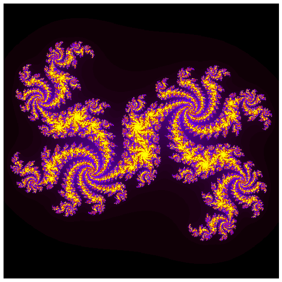

## What is Cython?

Cython is a programming language that makes writing C extensions for the Python language as easy as Python itself. The
source code gets translated into optimised C/C++ code and compiled as Python extension modules. The code is executed in
the CPython runtime environment, but at the speed of compiled C with the ability to call directly into C libraries, 
whilst keeping the original interface of the Python source code.

This enables Cython's two major use cases:

1. Extending the CPython interpreter with fast binary modules
2. Interfacing Python code with external C libraries

An important thing to remember is that Cython **IS** Python, only with C data types, so lets take a little but of time
to get into some datatypes.

## Typing

Cython supports static type declarations, thereby turning readable Python code into plain C performance. There are two
main recognised ways of "typing".

**Static Typing**

Type checking is performed during compile-time. For example, the expression `x = 4 + 'e'` would not compile. This
method of typing can detect type errors in rarely used code paths

**Dynamic Typing**

In contrast, type checking is performed during run-time. Here, the expression `x = 4 + 'e'` would result in a runtime
type error. This allows for fast program execution and tight integration with external C libraries.

> ## Datatype declarations
> Python is a programming language with an exception to the normal rule of datatype declaration. Across most 
> programming languages you will see variables associated with a specific type, such as integers (`int`), floats
> (`float`, `double`), and strings (`str`).
>
> We see datatypes used in pure Python when declaring things as a `list` or `dict`. For most Cython operations we will
> be doing the same for all variable types.
>
{: .callout}

## Implementing Cython

This can be implemetned either by Cython scripts or by using cell magics (`%%`) in Jupyter notebooks. Although the
notebooks are available, we also recommend trying these methods outside the notebook, as it is the more commonly used 
implementation. You can use Jupyter notebooks to create external files as an alternative.

> ## Using Jupyter Notebook cell magics with Cython
> 
> As discussed in [episode 2](02-timing-simple-speedup.md), we can use cell magics to implement Cython in Jupyter
> notebooks. The first cell magic that we need is to load Cython itself. This can be done with a separate cell block
> that only needs to be run once in the notebook.
>
> ~~~
> %load_ext cython
> ~~~
> {: .language-python}
> 
> From there, any cell that we wish to "cythonise" needs to have the following on the first line of any cell.
>
> ~~~
> %%cython
>
> # Some stuff
> ~~~
> {: .language-python}
{: .callout}

Let's look at how to cythonise a simple function which calculates the Fibonacci sequence for a given set of numbers, 
`n`. Below we have the python code for a file which we have named `fibonacci.py`. 

~~~
def fib(n):
    # Prints the Fibonacci series up to n.
    a, b = 0, 1
    while b < n:
        print(b)
        a, b = b, a + b
~~~
{: .language-python}

Although we are only dealing with one file here, it is common practice to have a "main" file from which all other files
and functions are called. This may seem unnecessary for this simple setup, but is good practice, particularly when you
have a setup that has dozens, hundreds of functions. We will create a simple `fibonacci_main.py` file which imports the
`fib` function, then runs it with a fixed value for `n`.

~~~
from fibonacci import fib

fib(10)
~~~
{: .language-python}

From here we can run the file in the terminal, or if you are using Jupyter notebook, you can use the cells themselves,
or use the `!` operator to implement bash in the codeblock.

~~~
$ python fibonacci_main.py
~~~
{: .language-bash}

That's our Python setup, now let's go about cythonising it. We will use the same function as before, but now we will
save it as a `.pyx` file. It can be helpful when dealing with Cython to rename your functions accordingly, as we can
see below.

~~~
def fib_cyt(n):
    # Prints the Fibonacci series up to n.
    a, b = 0, 1
    while b < n:
        print(b)
        a, b = b, a + b
~~~
{: .language-python}

Before we change our `fibonacci_main.py` to implement the function using Cython, we need to ado a few more things.
This `.pyx` file is compiled by Cython into a `.c` file, which itself is then compiled by a C compiler to a `.so` or
`.dylib` file. We will learn a bit more about these different file types in the [next episode](05.cffi.md).

There are a few different ways to build your extension module. We are going to look at a method which creates a file
which we will call `setup_fib.py`, which "cythonises" the file. It can be viewed as the `Makefile` of python. In it, we
need to import some modules and call a function which enables us to setup the file.

~~~
from distutils.core import setup, Extension
from Cython.Build import cythonize

setup(ext_modules = cythonize("fibonacci_cyt.pyx"))
~~~
{: .language-python}

Let us have a look at the contents of our current working directory, and see how it changes as we run this setup file.

~~~
$ ls
~~~
{: .language-bash}

~~~
04-Cython.ipynb   exercise          fibonacci_cyt.pyx setup_fib.py
__pycache__       fibonacci.py      fibonacci_main.py     
~~~
{: .output}

At this stage all we have are our original Python files, our .pyx file and setup_fib.py. Now lets run our 
`setup_fib.py` and see how that changes.

In the terminal (or by using `!` in notebook), we will now build the extension to use in the current working directory.

~~~

~~~
{: .language-bash}

You should get a printed message to the screen, now let's check the output of `ls` to see how our directory has changed.

~~~
04-Cython.ipynb                    fibonacci_cyt.c
__pycache__                        fibonacci_cyt.cpython-38-darwin.so
build                              fibonacci_cyt.pyx
exercise                           fibonacci_main.py
fibonacci.py                       setup_fib.py
~~~
{: .output}

So, a few more things have been added now.

1. The `.c` file, which is then compiled using a C compiler
2. The `build/` directory, which contains the `.o` file generated by the compiler
3. The `.so` or `.dylib` file. This is the compiled library

Next we add the `main` file which we will use to run our program. We can call it `fibonacci_cyt_main.py`.

~~~
from fibonacci_cyt import fib_cyt

fib_cyt(10)
~~~
{: .language-python}

Upon running it, you can see that it works the same as our regular version. We will get into ways on how to speed up
the code itself shortly.

> ## Compiling an addition module
>
> Define a simple addition module below, which containing the following function, and write it to a file called 
> `cython_addition.pyx.` Modify it to return x + y.
>
> ~~~
> def addition(x, y):
>    # TODO
> ~~~
> {: .language-python}
>
> Utilise the function by importing it into a new file, `addition_main.py`. Edit the `setup.py` accordingly to import
> the correct file. Use the demo above as a reference.
>
> > ## Solution
> >
> > `cython_addition.pyx`
> > ~~~
> > def addition(x, y):
> > print(x + y)
> > ~~~
> > {: .language-python}
> > 
> > `addition_main.py`
> > ~~~
> > from cython_addition import addition 
> > addition(2,3)
> > ~~~
> > {: .language-python}
> >
> > `setup.py`
> > ~~~
> > from distutils.core import setup, Extension
> > from Cython.Build import cythonize
> > 
> > setup(ext_modules = cythonize("cython_addition.pyx"))
> > ~~~
> > {: .language-python}
> > 
> > ~~~
> > $ python setup.py build_ext --inplace
> > $ python addition_main.py
> > ~~~
> > {: .language-bash}
> {: .solution}
{: .challenge}

## Accelerating Cython

Compiling with Cython is fine, but it doesn't speed up our code to actually make a significant difference. We need to
implement the C-features that Cython was designed for. Let's take the code block below as an example of some code to
speed up.

~~~
import time
from random import random

def pi_montecarlo(n=1000):
    '''Calculate PI using Monte Carlo method'''
    in_circle = 0
    for i in range(n):
        x, y = random(), random()
        if x ** 2 + y ** 2 <= 1.0:
            in_circle += 1
        
    return 4.0 * in_circle / n

N = 100000000

t0 = time.time()
pi_approx = pi_montecarlo(N)
t_python = time.time() - t0
print("Pi Estimate:", pi_approx)
print("Time Taken", t_python)
~~~
{: .language-python}

Running this as a `.py` file for 100,000,000 points will result in a time of `~27.98` seconds. Compiling with Cython 
will speed it up to `~17.20` seconds. 

It may be a speed-up but not as significant as we would want. There are a number of different methods we can use.

### Static type declarations

These allow Cython to step out of the dynamic nature of the Python code and generate simpler and faster C code, and 
sometimes it can make code faster by orders of magnitude.

This is often the simplest and quickest way to achieve significant speedup, but trade-off is that the code can become
more verbose and less readable.

Types are declared with `cdef` keyword. Now let's implement this into our montecarlo file.

~~~
def pi_montecarlo(int n=1000):
    cdef int in_circle = 0, i
    cdef double x, y
    for i in range(n):
        x, y = random(), random()
        if x ** 2 + y ** 2 <= 1.0:
            in_circle += 1
        
    return 4.0 * in_circle / n
~~~
{: .language-python}

Running this using the timing setup from the previous code block, by only declaring our variables as an `int` and 
`double` has decreased our execution time to `~4.03` seconds.

We can go further though!

### Typing function calls

As with 'typing' variables, you can also 'type' functions. Function calls in Python can be expensive, and can be even
more expensive in Cython as one might need to convert to and from Python objects to do the call.

There are two ways in which to declare C-style functions in Cython;
- Declaring a C-type function with `cdef`. This is the same as declaring a variable
- Creating a Python wrapper with `cpdef`

> ## Using `cdef` and `cpdef` in notebooks with magics
>
> A side-effect of `cdef` is that the function is no longer available from Python-space, so Python won't know how to
> call it.
>
> If we declare a simple function like below in a Jupyter notebook cell;
> 
> ~~~
> cdef double cube_cdef(double x):
>     return x ** 3
> ~~~
> {: .language-python}
> 
> And from there we use `%time cube_cdef(3)`, we will get the following error.
> ~~~
> ---------------------------------------------------------------------------
> NameError                                 Traceback (most recent call last)
> <timed eval> in <module>
> 
> NameError: name 'cube_cdef' is not defined
> ~~~
> {: .output}
>
> If we want to be able to use the magics command, we will need to use `cpdef`.
{: .callout}

Now let's implement our function call.

~~~
cdef double pi_montecarlo(int n=1000):
    '''Calculate PI using Monte Carlo method'''
    cdef int in_circle = 0, i
    cdef double x, y
    for i in range(n):
        x, y = random(), random()
        if x ** 2 + y ** 2 <= 1.0:
            in_circle += 1
        
    return 4.0 * in_circle / n
~~~
{: .language-python}

Our timing has reduced again to `~3.60` seconds. Not a massive decrease, but still significant.

Static type declarations and function call overheads can significantly reduce runtime, however there are additional
things you can do to significantly speed up runtime.

### NumPy arrays with Cython

Let's take a new example with a numpy array that calculates a 2D array.

~~~
import numpy as np
def powers_array(N, M):
    data = np.arange(M).reshape(N,N)
    
    for i in range(N):
        for j in range(N):
            data[i,j] = i**j
    return(data[2])

%time powers_array(15, 225)
~~~
{: .language-python}

~~~
CPU times: user 159 µs, sys: 112 µs, total: 271 µs
Wall time: 294 µs
array([    1,     2,     4,     8,    16,    32,    64,   128,   256,
         512,  1024,  2048,  4096,  8192, 16384])
~~~
{: .output}

A small function that takes a short amount of time, but there is a NumPy array we can cythonise. We need to import 
NumPy with `cimport` then declare it as a C variable.

~~~
import numpy as np # Normal NumPy import
cimport numpy as cnp # Import for NumPY C-API

def powers_array_cy(int N, int M): # declarations can be made only in function scope
    cdef cnp.ndarray[cnp.int_t, ndim=2] data
    data = np.arange(M).reshape((N, N))

    for i in range(N):
        for j in range(N):
            data[i,j] = i**j
    return(data[2])

%time powers_array_cy(15,225)
~~~
{: .language-python}

~~~
CPU times: user 151 µs, sys: 123 µs, total: 274 µs
Wall time: 268 µs
array([    1,     2,     4,     8,    16,    32,    64,   128,   256,
         512,  1024,  2048,  4096,  8192, 16384])
~~~
{: .output}

Note that for a small array like this, the speed up is not significant, you may even have got a slow down, why? Have a
think as we go through the final main step on how to speed up code. 

For larger problems with larger arrays, speeding up code using `cnp` arrays are recommended!

### Compiler directives

These affect the code in a way to get the compiler to ignore things that it would usually look out for. There are 
plenty of examples as discussed in the Cython documentation, however the main ones we will use here are;

- `boundscheck` - If set to `False`, Cython is free to assume that indexing operations in the code will not cause any
  IndexErrors to be raised
- `wraparound` - If set to `False`, Cython is allowed to neither check for nor correctly handle negative indices. This
  can cause data corruption or segmentation faults if mishandled, so use with caution!

You should implement these at a point where you know that the code is working efficiently and that any issues what
could be raised by the compiler are sorted. There are a few ways to implement them;

1. With a header comment at the top of a `.pyx` file, which must appear before any code

~~~
# cython: boundscheck=False
~~~
{: .language-python}

2. Passing a directive on the command line using the -X switch

~~~
$ cython -X boundscheck=True ...
~~~
{: .language-bash}

3. Or locally for specific functions, for which you first need the cython module imported

~~~
  cimport cython
  @cython boundscheck(False)
~~~
{: .language-python}

Let's see how this applies in our powers example.

~~~
import numpy as np # Normal NumPy import
cimport numpy as cnp # Import for NumPY C-API

cimport cython

@cython.boundscheck(False) # turns off 
@cython.wraparound(False)

def powers_array_cy(int N, int power): # number of 
    cdef cnp.ndarray[cnp.int_t, ndim=2] arr
    cdef int M
    M = N*N
    arr = np.arange(M).reshape((N, N))

    for i in range(N):
        for j in range(N):
            arr[i,j] = i**j
    return(arr[power]) # returns the ascending powers

%time powers_array_cy(15,4)
~~~
{: .language-python}

~~~
CPU times: user 166 µs, sys: 80 µs, total: 246 µs
Wall time: 238 µs
array([        1,         4,        16,        64,       256,      1024,
            4096,     16384,     65536,    262144,   1048576,   4194304,
        16777216,  67108864, 268435456])
~~~
{: .output}

## Typing and Profiling

For anyone new to Cython and the concept of declaring types, there is a tendency to 'type' everything in sight. This 
reduces readability and flexibility and in certain situations, even slow things down in some circumstances, such as 
what we saw in the previous code block. We have unnecessary typing

It is also possible to kill performance by forgetting to 'type' a critical loop variable. Tools we can use are 
profiling and annotation.

Profiling is the first step of any optimisation effort and can tell you where the time is being spent. Cython's 
annotation can tell you why your code is taking so long.

Using the `-a` switch in cell magics (`%%cython -a`), or `cython -a cython_module.pyx` from the terminal creates a HTML
report of Cython and generated C code. Alternatively, pass the `annotate=True` parameter to `cythonize()` in the 
`setup.py` file (Note, you may have to delete the C file and compile again to produce the HTML report).

This HTML report will colour lines according to typeness. White lines translate to pure C (fast as normal C code).
Yellow lines are those that require the Python C-API. Lines with a `+` are translated to C code and can be viewed by
clicking on it.

By default, Cython code does not show up in profile produced by cProfile. In Jupyter notebook or indeed a source file, 
profiling can be enabled by including in the first line;

~~~
# cython: profile=True
~~~
{: .language-python}

Alternatively, if you want to do it on a function by function basis, you can exclude a specific function while 
profiling code.

~~~
# cython: profile=True
import cython
@cython.profile(False)
cdef func():
~~~
{: .language-python}

Or alternatively, you only need to profile a highlighted function

~~~
# cython: profile=False
import cython
@cython.profile(True)
cdef func():
~~~
{: .language-python}

To run the profile in Jupyter, we can use the cell magics `%prun func()`

> ## Generate a profiling report
>
> Use the methoda described above to profile the Montecarlo code. What lines of the code hint at a Python interaction?
> Why?
> 
{: .challenge}

## Acceleration Case Study: Julia Set

Now we will look at a more complex example, the Julia set. This is also covered in the 
[Jupyter notebook](../files/03-Cython/03-Cython.ipynb). 

~~~
import matplotlib.pyplot as plt
import time
import numpy as np
from numpy import random
%matplotlib inline

mandel_timings = []

def plot_mandel(mandel):
    fig=plt.figure(figsize=(10,10))
    ax = fig.add_subplot(111)
    ax.set_aspect('equal')
    ax.axis('off')
    ax.imshow(mandel, cmap='gnuplot')
    plt.savefig('mandel.png')

def kernel(zr, zi, cr, ci, radius, num_iters):
    count = 0
    while ((zr*zr + zi*zi) < (radius*radius)) and count < num_iters:
        zr, zi = zr * zr - zi * zi + cr, 2 * zr * zi + ci
        count += 1
    return count

def compute_mandel_py(cr, ci, N, bound, radius=1000.):
    t0 = time.time()
    mandel = np.empty((N, N), dtype=int)
    grid_x = np.linspace(-bound, bound, N)

    for i, x in enumerate(grid_x):
        for j, y in enumerate(grid_x):
            mandel[i,j] = kernel(x, y, cr, ci, radius, N)
    return mandel, time.time() - t0

def python_run():
    kwargs = dict(cr=0.3852, ci=-0.2026,
              N=500,
              bound=1.2)
    print("Using pure Python")
    mandel_func = compute_mandel_py       
    mandel_set, runtime = mandel_func(**kwargs)
    print("Mandelbrot set generated in {} seconds\n".format(runtime))
    plot_mandel(mandel_set)
    mandel_timings.append(runtime)

%time python_run()
~~~
{: .language-python}

~~~
Using pure Python
Mandelbrot set generated in 22.584877729415894 seconds

CPU times: user 22.5 s, sys: 144 ms, total: 22.7 s
Wall time: 22.7 s
~~~
{: .output}

> ## Optimise the Julia set
>
> As mentioned, this pure python code is in need of optimisation. Conduct a step by step process to speed up the code.
> The steps that you take, as well as the estimated execution times for `N=500` should be as follows.
>
> 1. Compilation with Cython - ~ 19 seconds
> 2. Static type declarations - ~ 0.15 seconds
> 3. Declaration as C function - ~ 0.13 seconds
> 4. Fast Indexing and compiler directives - ~ 0.085 seconds
>    - use `cimport`
>    - look at the loops, is there a faster way of doing it?
>
> As you can see you might expect a speed up of roughly 250-300 times the original python code. The 
> [Jupyter notebook](../files/03-Cython/03-Cython.ipynb) outlines the process well if you need it, but try it out
> yourself. The solution is the final step.
>
> > ## Solution
> >
> > Feel free to continue experimenting, as you may still find a quicker method!
> > 
> > ~~~
> > import numpy as np
> > import time
> > cimport numpy as cnp
> > 
> > from cython cimport boundscheck, wraparound
> > 
> > @wraparound(False)
> > @boundscheck(False)
> > 
> > cdef int kernel(double zr, double zi, double cr, double ci, 
> >            double radius, int num_iters):
> >     cdef int count = 0
> >     while ((zr*zr + zi*zi) < (radius*radius)) and count < num_iters:
> >         zr, zi = zr * zr - zi * zi + cr, 2 * zr * zi + ci
> >         count += 1
> >     return count
> > 
> > def compute_mandel_cyt(cr, ci, N, bound, radius=1000.):
> >     t0 = time.time()
> >     
> >     cdef cnp.ndarray[cnp.int_t, ndim=2] mandel
> >     mandel = np.empty((N, N), dtype=int)
> >     
> >     cdef cnp.ndarray[cnp.double_t, ndim=1] grid_x
> >     grid_x = np.linspace(-bound, bound, N)
> >     
> >     cdef:
> >         int i, j
> >         double x, y
> >     
> >     for i in range(N):
> >         for j in range(N):
> >             x = grid_x[i]
> >             y = grid_x[j]
> >             
> >             mandel[i,j] = kernel(x, y, cr, ci, radius, N)
> >     return mandel, time.time() - t0
> > ~~~
> > {: .language-python}
> {: .solution}
{: .challenge}

~~~
def speed_run():
    kwargs = dict(cr=0.3852, ci=-0.2026,
              N=2000,
              bound=0.12)
    mandel_func = compute_mandel_cyt
    mandel_set, runtime = mandel_func(**kwargs)
    print("Mandelbrot set generated: \n")
    print("Using advanced techniques: {}\n".format(runtime))
    plot_mandel(mandel_set)
    print("Assuming the same speed up factor, our original code would take", (speed_up_factor*runtime)/60, "minutes")

speed_run()
~~~
{: .language-python}

~~~
Mandelbrot set generated: 

Using advanced techniques: 9.067986965179443

Assuming the same speed up factor, our original code would take 39.29461018244425 minutes
~~~
{: .output}


