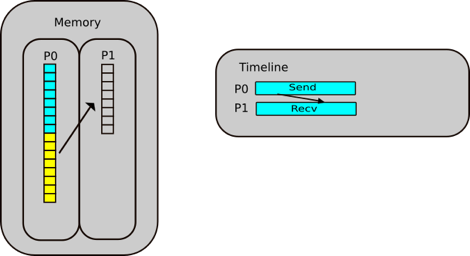

## Processes vs Threads

We are now looking at the true way to achieve parallelism in Python, and HPC, which is MPI, but before we look into
this in more detail, we need to have a clear understanding of the differences between a thread and a process.

Let's take the example of a keyboard when you are typing. One hand deals with one side of the keyboard, the other hand
the other sidee. Each of these hands can be thought of as an individual process. If we focus on one hand though, you 
have fingers. Each finger has specific tasks and keys which it should press, each of these can be thought of as a 
thread. Normally one works with either a group of processes or a group of threads in reality.

In more technical terms, a thread is:
- A dispatchable unit of work within a process
- Lightweight operation that use the memory of the process they belong to
- Threads share the same memory with other threads of the same process

In comparison, a process is:
- An instance of a program running on a computer
- Heavyweight operation as every process has its own memory space
- Processes don't share the memory with other processes

MPI works with processes, each process can be considered as a core on a machine. Most desktop machines have between 4
and 8 cores, so therefore, we can use MPI to make use of the cores. 

## What is MPI?

That all sounds great, but what is MPI, really? In short, it is the true way to achieve parallelism, an application 
programming interface (API) for communication between separate processes. MPI standards defines C, C++, Fortran
interfaces. Although we can technically use and import it through Python, the library itself, `mpi4py` is an unofficial
module. The fantastic feature about MPI si that programs with MPI are portable and scalable to run on tens to tens of
thousands of cores, which in a modern HPC-driven datacentric world is becoming so important.

Across MPI, over 300 procedures are possible, but in realith only about a dozen are really used. The MPI program itself
is launched as separate processes tasks each with their own address space. It was originally created in the 1980s-1990s,
at a time when scientific problems were demanding more memory. As a result, the idea was made to consider the memory of
several interconnected compute nodes as one, known now as distributed memory.

But what is Distributed memory? It is a set of processors that use their own local memory during computation. Each of 
these each exchange data through communications by sending and receiving messages. The key thing to remember, which 
will be touched on in more detail later is that cooperative operations are needed by each process. meaning that if one
sends, another receives.

The program is launched as separate processes tasks each with their own address space. As architecture trends changed,
shared memory systems were combined over networks creating hybrid distributed memory / shared memory systems. MPI 
implementors adapted their libraries to handle both types of underlying memory architectures seamlessly. They also 
adapted/developed ways of handling different interconnects and protocols.

Nowadays, MPI runs on virtually any hardware platform.

## Running MPI

So how do we go about running MPI in Python? Thankfully is it a simpler process than C or Fortran, as we normally need
an MPI call to start the MPI library. In Python, this isn’t needed as importing the `mpi4py` library is enough.

~~~
from mpi4py import MPI
~~~
{: .language-python}

The MPI program is launched as a set of independent, identical processes. These execute the same program code and
instructions, and can reside on different nodes/computers. There are a number of different ways to launch MPI programs,
and these differ based on whatever system you are running on differs depending on the system. Examples include, but are
not limited to `mpirun`, `mpiexec`, `srun`

> ## Important to note while using MPI 
> 
> MPI is not best utilised in a Jupyter notebook environment. This is because they are best used for demonstations and
> testing. If you wish to implement `mpi4py` in a working environment, we highly recommend you do so outside of a 
> notebook environment.
>
> If you are running MPI on an HPC system, you **MUST NOT USE THE LOGIN NODES**. You should use compute nodes when 
> running MPI code otherwise your jobs may be killed, you will restrict other users or worse be kicked out of the HPC!
> 
{: .callout}

Before we get to submitting files etc, we need to discuss the main things one needs in an MPI program. The first of
these is a **communicator**.

A communicator is a group of processes that contains all processes that will participate in communication. In `mpi4py`
most MPI calls are implemented as methods of a communicator object. This is done using `MPI.COMM_WORLD`. The user can
define custom communicators, which will be covered in a later section.

Once you have a communicator set up, you need a way of identifying all the MPI processes. These are known as **ranks**.
A rank is a logical ID number given to a process, and can also be used as a way to query the rank. Because of this 
feature, processes can perform different tasks based on their rank. You will get the chance to write code that follows
the following format.

~~~
if (rank == 0):
    # do something
elif (rank == 1):
    # do something else
else:
    # all other processes do something else
~~~
{: .language-python}

Aside from the rank, the number of processes also needs to be known. This is called the size, and is specified when you
initiate the program, i.e. at runtime. After importing MPI, the beginning of any MPI program will have the following 
three instructions.

~~~
comm = MPI.COMM_WORLD 
size = comm.Get_size()
rank = comm.Get_rank()
~~~
{: .language-python}

You will find that the most common routines in MPI include:
- Communication between processes, sending and receiving messages between 2 or more processes
- Synchronization between processes
- Communicator creation and manipulation
- Advanced features (e.g. user defined datatypes, one-sided communication and parallel I/O)

As one needs to submit MPI python files to compute nodes, it means that you will need to write a job script to submit 
to the queue. An example is shown below. MPI can technically work on login nodes, however you should always submit code
with MPI to the queue. 

~~~
#!/bin/bash
#SBATCH --nodes=1
#SBATCH --time=00:10:00
#SBATCH -A $ACCOUNT_NAME
#SBATCH --job-name=$JOB_NAME
#SBATCH -p $QUEUE_NAME
#SBATCH --reservation=$RESERVATION_NAME

module purge
module load conda
module list

source activate $ENVIRONMENT

cd $SLURM_SUBMIT_DIR

mpirun -np N python3 $FILE_TO_RUN

exit 0
~~~
{: .language-bash}

As you can see, the python files are run a bit differently when utilising MPI, as we need to specify (here with 
`mpirun`) that we want to utilise the MPI library. Next we have the notation `-np N`, where `-np` stands for
number of processes and `N` refers to the number of processes you wish to execute. For the purposes of this lesson,
and the exercises, we will specifically say how many processes to use.

## "Hello World" in MPI 

~~~
from mpi4py import MPI

# communicator containing all processes
comm = MPI.COMM_WORLD 

size = comm.Get_size()
rank = comm.Get_rank()

print("I am rank %d in group of %d processes" % (rank, size))
~~~
{: .language-python}

In the job script (which we can call `job.sh`), we can use the following line to run MPI.

~~~
mpirun -np 4 python3 hello.py
~~~
{: .language-bash}

~~~
$ sbatch job.sh
~~~
{: .language-bash}

You will receive a job ID number, which can be used to query the job status or delete the job if needed. The expected
output will be something similar to:

~~~
I am rank 0 in group of 4 processes
I am rank 1 in group of 4 processes
I am rank 2 in group of 4 processes
I am rank 3 in group of 4 processes
~~~
{: .output}

We say "similar to" as this output may not be replicated. The processes may finish at different times, so therefore you
may get the outputs in a different order. It also serves as proof that it is not serialised (i.e. one process runs
straight after another).

> ## Running your first MPI program
>
> Using the code below, set up the communicator, rank and size, and then create a list from 1-4, and use a for loop to 
> multiply the element of the list by the rank. Add a print statement to show how the array changes depending on the
> rank.
>
> Use the job script template as shown further above. Your instructor will give you the items to replace for the 
> variables `$ACCOUNT_NAME`, `$QUEUE_NAME` and `$RESERVATION_NAME`. You can choose the `$JOB_NAME` yourself.
>
> ~~~
> from mpi4py import MPI
> 
> # TODO: Set up communicator 
> # TODO: Get the rank
> # TODO: Get the size
>
> # TODO: Create array and loop
> 
> print("I am rank %d in group of %d processes" % (rank, size))
> # TODO: Add print statement
> ~~~
> {: .language-python}
> 
> > ## Solution
> >
> > ~~~
> > from mpi4py import MPI
> > 
> > # communicator containing all processes
> > comm = MPI.COMM_WORLD 
> > 
> > size = comm.Get_size()
> > rank = comm.Get_rank()
> > 
> > arr = [1,2,3,4]
> > for i in range(len(arr)):
> >     arr[i] = i*rank
> > 
> > print("I am rank %d in group of %d processes" % (rank, size))
> > print("My list is", arr)
> > ~~~
> > {: .language-python}
> > 
> {: .solution}
{: .challenge} 

## Point to Point communication

Point to Point communication in its simplest terms is like a game of ping pong. Imagine the ping-pong ball as your
message, and each racket as a process. MPI does its communications through messages, and these, in computational terms
are a number of elements of a particular datatype. These can be basic or special MPI derived datatypes. Point to Point
communication itself is when a source (`src`) **sends** a message to a destination. But like with ping pong, if you 
send/serve the ball/message you don't just need both sides of the table. You need a destination, (`dest`) i.e. another
racket/process to **receive** it.

This communication takes place within the communicator `MPI.COMM_WORLD`. Each process in a communicator is identified
by their ranks in the communicator. Sends and receives in a program should match, one receive per send, like with our
ping pong rally.

When it comes to sends and receives, there are two main types. 

**Synchronous Send:** Imagine this situation like a WhatsApp message, you send the message, and you see a green tick
appear showing that the message is sent, and another that it has been received (followed by them turning blue showing 
it has been read). This is known as a synchronous send, as you, the sender knows that the message has been received.

**Buffered/Asynchronous Send:** An asynchronous send is analogous to sending a message in the mail. You, the sender
know that the message has left, but do not know whether it has been or will be received.

We will now move onto an example that uses send and receive, and we will run this with **4 ranks**.

~~~
from mpi4py import MPI

# communicator containing all processes
comm = MPI.COMM_WORLD 
rank = comm.Get_rank()

if rank == 0:
    data = {'a': 7, 'b': 3.14}
    comm.send(data, dest=1)
    print('rank ', rank, ' sent: ', data)
elif rank == 1:
    data = comm.recv(source=0)
    print('rank ', rank, ' received: ', data)
else:
    print('rank ', rank, ' did not receive data')
~~~
{: .language-python}

We set up our communicator, `comm` as well as our `rank` and use these objects to call `send` and `recv` as well as
querying and returning our ranks. We continue with our rank 0, which contains some data, in this case a dictionary, and
we want to send this data, to a destination, and we specify the destination rank. If you have used MPI with C and 
Fortran this is a simplified notation.

Now, we want to say that if our rank equals 1, we have to receive it, for every send in this way of doing this we need
a receive, specifying the rank from which the message came from. If we are at `rank=0` and `rank=1` sent a message, we
need to know to expect a message from `rank=1`. If, however, we are told to expect a message instead from `rank=2`, we
will be waiting until the end of time for that message to arrive. A message that was never sent. These are known as 
**deadlocks** and we will cover them in more detail in the 
[next episode](https://ichec-learn.github.io/python-hpc/07-mpi-nonblocking-collectives/index.html). For now
though let us look at our output.

~~~
rank  3  did not receive data
rank  2  did not receive data
rank  0  sent:  {'a': 7, 'b': 3.14}
rank  1  received:  {'a': 7, 'b': 3.14}
~~~
{: .output}

As we can see in our output, ranks 2 and 3 did not receive any data, because we never specified the tasks for these
processes to do. Technically they did, issuing a print statement, but no more than that. Prior to sending the data, 
rank 1 was empty, and now, having received the data, from rank 0, the latter is now empty. The data is provided as a
return value in rank 1.

Typical Point-to-Point communication patterns include pariwise exchanges, where processes talk to their neighbours. 
The incorrect ordering of sends and receives can result in a deadlock.

> ## Pairwise exchange 
>
> Copy the code block below into a file caled `pairwise_exchange.py`, implement a one-dimensional pairwise exchange of
> the ranks of `N` processes with periodic boundary conditions. That is, each process communicates its rank to each of
> its topological neighbours.
> 
> ~~~
> from mpi4py import MPI
> 
> comm = MPI.COMM_WORLD 
> rank = comm.Get_rank()
> size = comm.Get_size()
> 
> # TODO: Define neighbours
> 
> # TODO: Use send and recv to set up neighbours
> 
> print ('I am process ', rank, ', my neighbours are processes', left, ' and ', right)
> ~~~
> {: .language-python}
> 
> For 4 processes, the output will be similar to;
> 
> ~~~
> I am process  1 , my neighbours are processes 0  and  2
> I am process  3 , my neighbours are processes 2  and  0
> I am process  0 , my neighbours are processes 3  and  1
> I am process  2 , my neighbours are processes 1  and  3
> ~~~
> {: .output}
> 
> HINT: left_rank is related to the rank and the size, but how? If you are a rank, what would you perceive as being
> left and right? You will need multiple sends and receives
>
> > ## Solution
> > 
> > ~~~
> > from mpi4py import MPI
> > 
> > comm = MPI.COMM_WORLD 
> > rank = comm.Get_rank()
> > size = comm.Get_size()
> > 
> > left_rank = (rank - 1) % size
> > right_rank = (rank + 1) % size
> > 
> > if (rank % 2) == 0:
> >     comm.send(rank, dest=right_rank)
> >     comm.send(rank, dest=left_rank)
> >     left = comm.recv(source=left_rank)
> >     right = comm.recv(source=right_rank)
> > else:
> >     left = comm.recv(source=left_rank)
> >     right = comm.recv(source=right_rank)
> >     comm.send(rank, dest=right_rank)
> >     comm.send(rank, dest=left_rank)   
> > 
> > print ('I am process ', rank, ', my neighbours are processes', left, ' and ', right)
> > ~~~
> > {: .language-python}
> {: .solution}
{: .challenge}

## Case Study Parallel sum

Let us walk through a parallel sum case study. The idea is that we scatter our data between two processes, P0 and
P1. Half of our array is sent to P1, and from there P0 and P1 independently sum their segments. 
From there, the summed array needs to be reduced, i.e. put back together again, from which P0 then sums the 
partial sums.

**Step 1.1**: Receive operation in scatter

P1 posts a **receive** to **receive** *half* of the array **FROM** P0

**Step 1.2**: Send operation in scatter

P0 posts a **send** to **send** the lower half of the array **TO** P1

**Step 2**: Compute the sum in parallel

P0 & P1 compute their parallel sums and stores them locally

**Step 3.1**: **Receive** operation in reduction

P0 posts a **receive** to **receive** the partial sum

**Step 3.2**: **Send** operation in reduction

P1 posts a **send** to **send** partial sum

**Step 4**: Compute the final answer.

P0 sums the partial sums

> ## Parallel sum implementation
> 
> Implement the parallel sum case study. That is;
> 
> - take the code block below
> - implement the appropriate send/receive to distribute the data from rank 0
> - perform the partial sum on each process
> - implement the appropriate send/receive to gather the data at rank 0
> - compute the final sum from the gathered data on rank 0
> 
> (Bonus) For added difficulty (and best practice), try to implement the same approach with an arbitrary number of processes.
>
> ~~~
> from mpi4py import MPI
> import numpy as np
> 
> comm = MPI.COMM_WORLD
> rank = comm.Get_rank()
> 
> local_data = np.empty( , dtype=int)
> 
> # Distribute data
> if rank==0:
>     data = np.arange(100, dtype=int)
>     local_data = data[] # TODO: choose appropriate range
>     # TODO: Communicate
> else:    
>     # TODO: Communicate
> 
> # TODO: Compute local and partial sums
> local_sum = np.sum(local_data)
> 
> # Collect data
> if rank==0:
>     partial_sums = np.empty( , dtype=int)
>     # TODO: Communicate
> 
>     # TODO: Calculate total sum
> 
>     # TODO: Print result
> else:
>     # TODO: Communicate
> ~~~
> {: .language-python}
> 
> > ## Solution
> > ~~~
> > from mpi4py import MPI
> > import numpy as np
> > 
> > comm = MPI.COMM_WORLD
> > rank = comm.Get_rank()
> > size = comm.Get_size()
> > 
> > n = 100
> > local_n = n // size
> > 
> > local_data = np.empty(local_n , dtype=int)
> > 
> > # distribute data
> > if rank==0:
> >     data = np.arange(100, dtype=int)
> >     local_data = data[:local_n] # choose appropriate range
> > 
> >     # communicate
> >     for i in range(1, size):
> >         comm.Send(data[i*local_n:(i + 1)*local_n], i)
> > else:    
> >     comm.Recv(local_data, 0)
> > ~~~
> > {: .language-python}
> {: .solution}
{: .challenge}

## Communicating arrays

Now we move onto communicating numpy arrays, and this is where you need to be careful. There are two sends and receives
in `mpi4py`, `send`/`Send` and `recv`/`Recv`. As you can see one is capitalised, the other is not. It is important to 
point out that data needs to exist in the receive buffer, whereas for items like a dictionary all we needed to say is 
that there is data coming from another rank. In the example below So here we are sending an array of floats of 
`size=10`, and we need a buffer, we call the variable `data` to receive that array into. It works a bit like sending 
apples from one basket into another. The receive cannot happen if there is no "basket" to put it into.

~~~
from mpi4py import MPI
import numpy as np

comm = MPI.COMM_WORLD
rank = comm.Get_rank()

if rank==0:
    data = np.arange(10, dtype=float)
    comm.Send(data, dest=1)
    print('rank ', rank, ' sent: ', data)
elif rank==1:
    data = np.empty(10, dtype=float)
    comm.Recv(data, source=0)
    print('rank ', rank, ' received: ', data)
~~~
{: .language-python}

Running the code will provide the following output.

~~~
rank  0  sent:  [0. 1. 2. 3. 4. 5. 6. 7. 8. 9.]
rank  1  received:  [0. 1. 2. 3. 4. 5. 6. 7. 8. 9.]
~~~
{: .output}

## Combined Send and Receive

This is a fairly simple concept which combines the two commands `send` and `recv` into a single command. We will use
what we learned in the previouus section to use NumPy arrays.

~~~
from mpi4py import MPI
import numpy as np

comm = MPI.COMM_WORLD
rank = comm.Get_rank()

# Send buffer
data = np.arange(10, dtype=float) * (rank + 1)

# Receive buffer
buffer = np.empty(10, float)

if rank==0:
    dest, source = 1, 1
elif rank==1:
    dest, source = 0, 0
    
print('rank ', rank, ' send buffer: ', data)
    
comm.Sendrecv(data, dest=dest, recvbuf=buffer, source=source)

print('rank ', rank, ' receive buffer: ', buffer)
~~~
{: .language-python}

Running this code with **2 processes** produces the following output.

~~~
rank  0  send buffer:  [0. 1. 2. 3. 4. 5. 6. 7. 8. 9.]
rank  0  receive buffer:  [ 0.  2.  4.  6.  8. 10. 12. 14. 16. 18.]
rank  1  send buffer:  [ 0.  2.  4.  6.  8. 10. 12. 14. 16. 18.]
rank  1  receive buffer:  [0. 1. 2. 3. 4. 5. 6. 7. 8. 9.]
~~~
{: .output}

Now that you have a clear idea of the power of a combined send and receive, let us now modify our pairwise code.

> ## SendRecv pairwise exchange
> 
> Modify the pairwise exchange code from Exercise 2 to use the combined send/recv communication.
>
> > ## Solution
> > ~~~
> > from mpi4py import MPI
> > 
> > comm = MPI.COMM_WORLD 
> > rank = comm.Get_rank()
> > size = comm.Get_size()
> > 
> > left_rank = (rank - 1) % size
> > right_rank = (rank + 1) % size
> > 
> > right = comm.sendrecv(rank, dest=right_rank, source=left_rank)
> > left = comm.sendrecv(rank, dest=left_rank, source=right_rank)
> > 
> > print ('I am process ', rank, ', my neighbours are processes', left, ' and ', right)
> > ~~~
> > {: .language-python}
> {: .solution}
{: .challenge}

