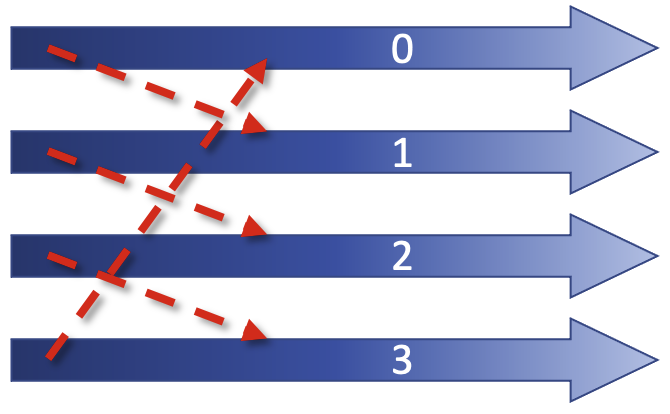
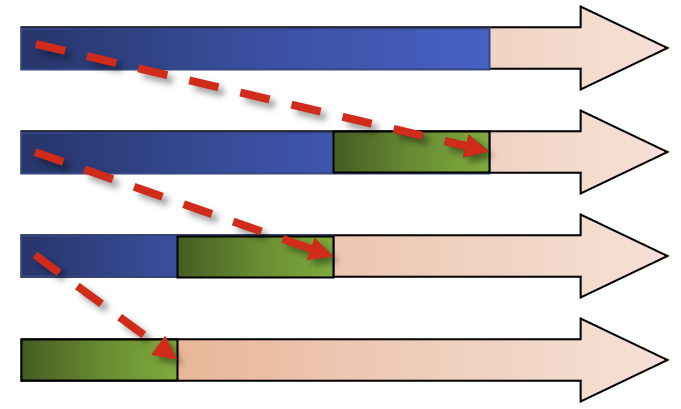
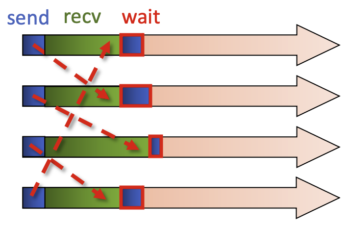
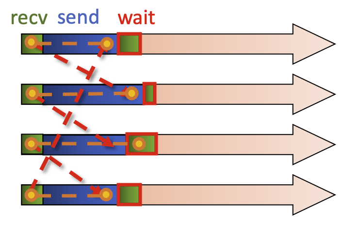
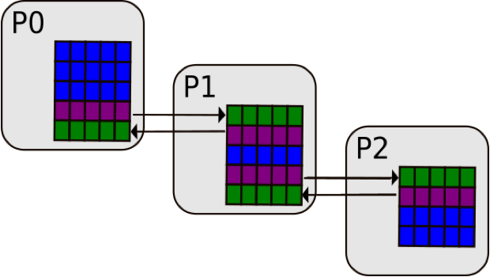
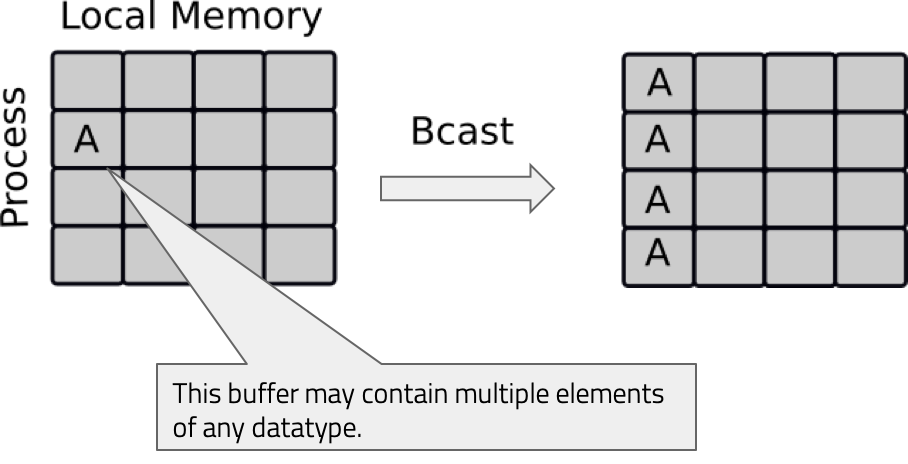
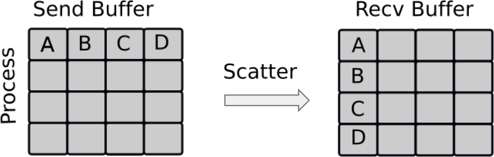
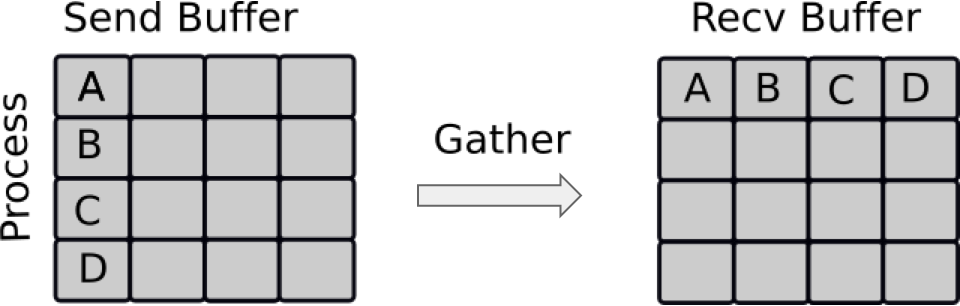
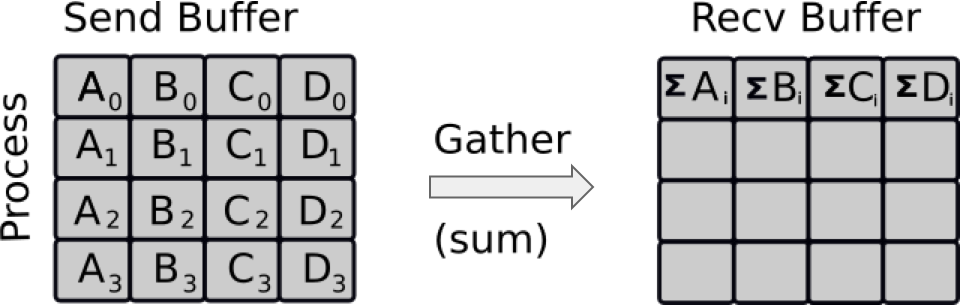
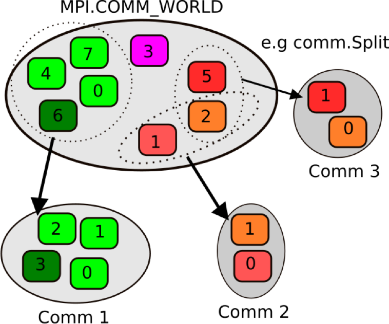

## Non-blocking communication

In the previous episode we covered the basics of MPI, becoming familiar with communicators, rank, size, and running MPI
for simple calculations and then onto sending and receiving. It's all well and good but the communication types we 
covered introduce the risk of deadlocks. These can similar to infinite loops or more specifically have a 
situation where one process is expecting a message, but it was never even sent. These deadlocks will continue until
the program is physically terminated. This can be resolved with non-blocking communication. The routines covered so far,
`send`, `Send`, `recv` and `Recv` are all blocking routines. Let us walk through a common scenario of a cyclic structure.

In this example, all our processes form part of a ring, with rank 0’s neighbours being rank 1 and rank 3, and so on. We
also have a non cyclic workflow.

If we try and program this with MPI `Send` and `Recv`, it can be dangerous. If we have small messages this is can work,
but as soon as the programmer ends up dealing with larger messages, they can become unstuck. MPI has a synchronous 
protocol, and as soon as this switch happens, all the processes stop in MPI Send, meaning that Recv is never called
which means that all the processes will be blocked forever. 

For non-cyclic workflows, there is an upside, as the last process is not calling Send, so this will start Recv, then
the next rank will start receive, so we have a serialisation routine.

> ## Which is better?
>
> Which is a better situation to end up in? Having a;
> 
> - Serialised routine?
> 
> OR
>
> - A deadlock?
>
> > ## Solution
> >
> > Contrary to what you may think, a **deadlock** is better in this circumstance, because you can easily identify it
> > and then promptly fix it. The non-cyclic situation is worse, as you have no indication that your code is being 
> > slowed down by a factor of 3. 
> > 
> > Imagine if you had 10 processes, 50, 100? What if you have 1000 processes in 3 dimensions, 9 connections between
> > them. Think about how much slowdown there would be if it was a serialised code! Something which in your mind that
> > should take 10 minutes may take 10 hours, or more!
> {: .solution}
{: .challenge}

To work with non-blocking communication our workflow can be split into 3 phases.

~~~
rank = comm.Get_rank()
size = comm.Get_size()

if rank == 0:
    data = np.arange(size, dtype=float) * (rank + 1)
    # start a send
    req = comm.Isend(data, dest=1)
    # ... do something else ...
    calculate_something(rank)
    # wait for the send to finish
    req.wait()
    # now safe to read/write data again

elif rank == 1:
    data = np.empty(size, dtype=float)
    # post a receive
    req = comm.Irecv(data, source=0)
    # ... do something else ...
    calculate_something(rank)
    # wait for the receive to finish
    req.wait()
    # data is not ready to use
~~~
{: .language-python}

1. Initiate nonblocking communication. This returns immediately and sends/receives in the background. Our return value
   is set up as a request object The notation for non-blocking send is `Isend`, and for receive, `Irecv`. This `I` 
   stands for "incomplete" or "immediate" and are done locally, returning independently of any other processes activity.

2. Do some work, be it related to what you want done in the process or some other communication. The most important 
   usage area is to overlap communication with other communication. Or indeed you could have several communicators that
   use the MPI library in parallel.

3. From there, we wait for nonblocking communication to complete. The send buffer is read out of recv is readlly read 
   in.

In summary, like an email you send it, then you can do other work until you hear a noise informing you that your email
has been sent, at which point your send buffer is refreshed. From there, call `Irecv`, and do some work, wait until 
the message has arrived. Let's think again of our example working with a ring.

We call the non-blocking sends and these come back immediately, and from there we can call the blocking `recv`, so all
processes are calling the blocking `recv`. Now we have a non-blocking send and a blocking recv. This then allows the
message to flow. We then call the MPI command to `wait` for the non-blocking send. Because the message has been 
received there is no need for extra waiting, and then you can reuse the send buffer.

The alternative is to initiate a non-blocking receive, with each process calling receive. The other work we can do is a
blocking send, the message can be transferred.

Here is another example, where one needs to know the boundary conditions in a process. In P0, we have our final row, 
the `border_data` and then some `ghost_data` as well as the `local_data` that stays local to the process, in this case
P0.

~~~
request = comm.Irecv(ghost_data)
request2 = comm.Isend(border_data)
compute(ghost_independent_data)
request.wait()
compute(border_data)
~~~
{: .language-python}

We initialise a request to `Irecv` (or receive in a non-blocking way) the `ghost_data` from process 1, and then use the
non-blocking `Isend` on the `border_data` to process 1 so it can then do its own calculation. We can then continue and
do some other work, as it is non-blocking. This is represented by a generic function which operates on 
`ghost_independent_data` then wait for the sending and receiving to complete, and then we can work on the border data.

We need to briefly touch on "waiting" for data. When it comes to dealing with multiple non-blocking operations, 
`waitany()` and `waitall()` methods can be very helpful, and are available in the `MPI.Request` class.

Let us now look at a working example with a small array before our next challenge. Note the import of the `Request`
class ou can have a little go of this yourselves. Note that we import the `Request` class while we import the other
items we need.

~~~
from mpi4py import MPI
from mpi4py.MPI import Request
import numpy as np

comm = MPI.COMM_WORLD
rank = comm.Get_rank()

# data = send buffer
data = np.arange(10, dtype=float) * (rank + 1)
# buffer = receive buffer
buffer = np.zeros(10, dtype=float)

print('rank', rank, 'sending:', data)

if rank == 0:
    req = [comm.Isend(data, dest=1)]
    req.append(comm.Irecv(buffer, source=1))
if rank == 1:
    req = [comm.Isend(data, dest=0)]
    req.append(comm.Irecv(buffer, source=0))
    
print('rank', rank, 'receive buffer before wait:', buffer)
    
Request.waitall(req)
~~~
{: .language-python}

We set up our data which is a simple size=10 numpy array multiplied by the (rank + 1), and our receive buffer, where
this will be put into. These now will exist in both rank 0 and 1.

On output with 2 processes you should expect the following result.

~~~
rank 0 sending: [0. 1. 2. 3. 4. 5. 6. 7. 8. 9.]
rank 0 receive buffer before wait: [0. 0. 0. 0. 0. 0. 0. 0. 0. 0.]
rank 0 receive buffer after wait: [ 0.  2.  4.  6.  8. 10. 12. 14. 16. 18.]
rank 1 sending: [ 0.  2.  4.  6.  8. 10. 12. 14. 16. 18.]
rank 1 receive buffer before wait: [0. 0. 0. 0. 0. 0. 0. 0. 0. 0.]
rank 1 receive buffer after wait: [0. 1. 2. 3. 4. 5. 6. 7. 8. 9.]
~~~
{: .output}

So, when it comes to point-to-point communication, non-blocking communication is often the best method to go to with
the aim of reducing the probability of deadlocks. This is the most important concept of MPI, and we recommend spending
a good bit of time trying to wrap your head around it! Once you are comfortable with it, you are well set for most other
problems you may encounter.

> ## Non-blocking communication in a ring
> 
> Before starting, it is important to state that this code **can** work, but it is still **wrong**, deceptively so as
> we have learned. Using a synchronous send, `Ssend`, will definitely cause a deadlock. This example will run very 
> quickly so if a result doesn’t come back in a matter of seconds, you have a deadlock. Using a regular `Send` will at
> some point cause a deadlock, but not 100% of the time.
> 
> The code is set up in such a way so that:
> - A set of processes are arranged in a ring
> - Each process stores its rank in MPI.COMM_WORLD into an integer variable, snd_buf
> - Each process passes this snd_buf to the neighbour on its right
> - Prepares for the next iteration
> - Each processor calculates the sum of all values
> Steps 2-4 are repeated with n number of times (number of processes) and each process calculates the sum of all ranks.
> 
> For this exercise only use **`Issend`**, which is used to demonstrate a deadlock is the non-blocking routine is 
> incorrectly used. Real applications use `Isend`, not `Issend`.
>
> You can monitor the status of your job with `squeue jobid`. If you encounter a deadlock, you must cancel the job. Use
> `scancel jobid` to do so.
>
> ~~~
> from mpi4py import MPI
> import numpy as np
> 
> rcv_buf = np.empty((), dtype=np.intc)
> #rcv_buf = np.empty((), dtype=np.intc) # uninitialized 0 dimensional integer array
> status = MPI.Status()
> 
> comm = MPI.COMM_WORLD
> my_rank = comm.Get_rank()
> size = comm.Get_size()
> 
> right = (my_rank+1) % size
> left  = (my_rank-1+size) % size
> 
> sum = 0
> snd_buf = np.array(my_rank, dtype=np.intc) # 0 dimensional integer array with 1 element initialized with the value of my_rank
> 
> for i in range(size):
>    comm.Send((snd_buf, 1, MPI.INT), dest=right, tag=17)
> 
>    #request = comm.Isend((snd_buf, 1, MPI.INT), dest=right, tag=17)
> 
> 
>    comm.Recv((rcv_buf, 1, MPI.INT), source=left,  tag=17, status=status)
>    #request.Wait(status)
>    np.copyto(snd_buf, rcv_buf) # We make a copy here. What happens if we write snd_buf = rcv_buf instead?
>    sum += rcv_buf
> print(f"PE{my_rank}:\tSum = {sum}")
> ~~~
> {: .language-python}
> 
> > ## Solution
> >
> > ~~~
> > from mpi4py import MPI
> > import numpy as np
> > 
> > rcv_buf = np.empty((), dtype=np.intc)
> > status = MPI.Status()
> > 
> > comm = MPI.COMM_WORLD
> > my_rank = comm.Get_rank()
> > size = comm.Get_size()
> > 
> > right = (my_rank+1) % size
> > left  = (my_rank-1+size) % size
> > 
> > sum = 0
> > snd_buf = np.array(my_rank, dtype=np.intc) # 0-D integer array with 1 element initialized with the value of my_rank
> > 
> > for i in range(size):   
> >    # Official solution to be used in your code outside of lesson
> >    request = comm.Isend((snd_buf, 1, MPI.INT), dest=right, tag=17)
> >    comm.Recv((rcv_buf, 1, MPI.INT), source=left,  tag=17, status=status)
> >    request.Wait(status)
> >    np.copyto(snd_buf, rcv_buf) 
> >    sum += rcv_buf
> > print(f"PE{my_rank}:\tSum = {sum}")
> > ~~~
> > {: .language-python}
> {: .solution}
{: .challenge}

## Collective communication

Collective communication is the step up from simple sends and receives, as it transmits data among all processes in a
process group. Regardless of what process group you are in (more on communicator groups later), these routines must be
called by all processes in a given group, so you need to be careful about having the correct amount of sent and 
received data.

These operations can be used for data movement, collective computation or synchronization. The idea of collective
communication is to shorten the material we had in our send receive codes into a single line.

### Broadcasting

With broadcasting (`Bcast`), an array on rank 0 can be communicated to all other tasks. The data is not modified in any 
way and all the processes receive the same data.

Let's looks at a broadcasting code. We have our communicator, and rank, and we are broadcasting a python dictionary and
a NumPy array to all the other processes. As with sends and receives, we have an upper and lowercase broadcast, so all
the other processes aside from rank 0 have empty NumPy arrays of the same size. For the python object it doesn’t
matter, but you do need to declare that the variable actually exists. 

~~~
from mpi4py import MPI
import numpy as np

comm = MPI.COMM_WORLD
rank = comm.Get_rank()

if rank == 0:
    # Python object
    py_data = {'key1' : 0.0, 'key2' : 11}
    # NumPy array
    data = np.arange(8)/10
else:
    py_data = None
    data = np.zeros(8)

# Broadcasting the python object
new_data = comm.bcast(py_data, root=0)
print('rank', rank, 'received python object:', new_data)
# Broadcasting the NumPy array
comm.Bcast(data, root=0)
print('rank', rank, 'received NumPy array:', data)
~~~
{: .language-python}

Upon running this with 4 processes you should expect the following output.

~~~
rank 0 received python object: {'key1': 0.0, 'key2': 11}
rank 0 received NumPy array: [0.  0.1 0.2 0.3 0.4 0.5 0.6 0.7]
rank 1 received python object: {'key1': 0.0, 'key2': 11}
rank 1 received NumPy array: [0.  0.1 0.2 0.3 0.4 0.5 0.6 0.7]
rank 2 received python object: {'key1': 0.0, 'key2': 11}
rank 2 received NumPy array: [0.  0.1 0.2 0.3 0.4 0.5 0.6 0.7]
rank 3 received python object: {'key1': 0.0, 'key2': 11}
rank 3 received NumPy array: [0.  0.1 0.2 0.3 0.4 0.5 0.6 0.7]
~~~
{: .output}

Next we will look at scattering.

### Broadcasting
### Scattering

Scattering is very similar to broadcasting, but the difference is important. MPI Broadcast, like the news sends the
same information to all processes, whereas Scatter sends chunks of an array to different processes.

If you have watched BBC news, you have the main broadcast, think of like MPI Bcast, followed up intermittently by the 
regional information, one for Northern Ireland, one for Midlands, Scotland etc. That is similar to a scatter.

Looking at an example, for our lowercase scatter, we only need our python data and the root process, however for the
NumPy scatter, we need a receive buffer.

~~~
from mpi4py import MPI
import numpy as np

comm = MPI.COMM_WORLD
rank = comm.Get_rank()
size = comm.Get_size()

if rank == 0:
    # Python object
    py_data = range(size)
    data = np.arange(size**2, dtype=float)
else:
    py_data = None
    data = None
print("Original data = ", data)

# Scatter the python object
new_data = comm.scatter(py_data, root=0)
print('rank', rank, 'received python object:', new_data)

# Scatter the NumPy array
# A receive buffer is needed here!
buffer = np.empty(size, dtype=float)
comm.Scatter(data, buffer, root=0)
print('rank', rank, 'received NumPy array:', buffer)
~~~
{: .language-python}

Upon running this with 4 processes you should expect the following output.

~~~
Original data =  [ 0.  1.  2.  3.  4.  5.  6.  7.  8.  9. 10. 11. 12. 13. 14. 15.]
rank 0 received python object: 0
rank 0 received NumPy array: [0. 1. 2. 3.]
Original data =  None
rank 2 received python object: 2
rank 2 received NumPy array: [ 8.  9. 10. 11.]
Original data =  None
rank 3 received python object: 3
rank 3 received NumPy array: [12. 13. 14. 15.]
Original data =  None
rank 1 received python object: 1
rank 1 received NumPy array: [4. 5. 6. 7.]
~~~
{: .output}

### Gathering

Gathering is the inverse of Scatter. Instead of spreading elements from one process to many processes, MPI_Gather
takes elements from many processes and gathers them to one single process. This routine is highly useful to many 
parallel algorithms, such as parallel sorting and searching.

Using the combination of Scatter and Gather you can do a lot of useful things, a very simple example being the 
computation of the average of numbers.

For the demonstration we want an list n that gets the gathered ranks, this is a simple python list. As with Scatter,
Gather needs a buffer which we define here.

So as you can see these three have a lot in common and behave similarly.

~~~
from mpi4py import MPI
import numpy as np

comm = MPI.COMM_WORLD
rank = comm.Get_rank()
size = comm.Get_size()

data = np.arange(10, dtype=float) * (rank + 1)

# Gather the value of rank from each rank, then send to rank 0
n = comm.gather(rank, root=0)

# Gather the NumPy array from each rank, then send to rank 0
buffer = np.zeros(size * 10, dtype=float)
comm.Gather(data, buffer, root=0)

if rank == 0:
    print('gathered ranks:', n)
    print('gathered NumPy arrays:', buffer)
~~~
{: .language-python}

Upon running this with 4 processes you should expect the following output.

~~~
gathered ranks: [0, 1, 2, 3]
gathered NumPy arrays: [ 0.  1.  2.  3.  4.  5.  6.  7.  8.  9.  0.  2.  4.  6.  8. 10. 12. 14.
 16. 18.  0.  3.  6.  9. 12. 15. 18. 21. 24. 27.  0.  4.  8. 12. 16. 20.
 24. 28. 32. 36.]
~~~
{: .output}

> ## Point to Point --> Gather
> 
> The Send and Receive code here works perfectly as is, but using `gather` would certainly make things much cleaner,
> as we only have to call one MPI command.
>
> Substitute the point-to-point communication with one call to `gather`. Watch out to ensure
> 
> ~~~
> from mpi4py import MPI
> import numpy as np
> 
> comm = MPI.COMM_WORLD
> my_rank = comm.Get_rank()
> num_procs = comm.Get_size()
> 
> # Each process assigned some work
> res = np.array(my_rank**2, dtype=np.double)
> print(f"I am process {my_rank} out of {num_procs}, result={res:f}")
> if (my_rank == 0):
>    res_arr = np.empty(num_procs, dtype=np.double)
> 
> # TODO: Substitute the following block with MPI_Gather
> ###
> if (my_rank != 0):  
>    # Sending some results from all processes (except 0) to process 0:
>    comm.Send((res, 1, MPI.DOUBLE), dest=0, tag=99)
> else: 
>    res_arr[0] = res # process 0's own result
>    # Receive all the messages
>    for rank in range(1,num_procs):
>       # Result of processes 1 -> n
>       comm.Recv((res_arr[rank:], 1, MPI.DOUBLE), source=rank, tag=99, status=None) 
> ###
> 
> if (my_rank == 0):
>    for rank in range(num_procs):
>       print(f"I'm proc 0: result of process {rank} is {res_arr[rank]:f}")
> ~~~
> {: .language-python}
> 
> > ## Solution
> > 
> > ~~~
> > from mpi4py import MPI
> > import numpy as np
> > 
> > #MPI-related data
> > comm = MPI.COMM_WORLD
> > my_rank = comm.Get_rank()
> > num_procs = comm.Get_size()
> > 
> > result = np.array(my_rank**2, dtype=np.double)
> > print(f"I am process {my_rank} out of {num_procs}, result={result:f}")
> > 
> > if (my_rank == 0):
> >    res_arr = np.empty(num_procs, dtype=np.double)
> > else:
> >    res_arr = None
> > 
> > comm.Gather((result,1,MPI.DOUBLE), (res_arr,1,MPI.DOUBLE), root=0) 
> > if (my_rank == 0):
> >    for rank in range(num_procs):
> >       print(f"I'm proc 0: result of process {rank} is {res_arr[rank]:f}")
> > ~~~
> > {: .language-python}
> >
> {: .solution}
{: .challenge}

### Reduction Operation

Reduce is a classic concept from functional programming. Data reduction involves reducing a set of numbers into a
smaller set of numbers via a function. For example, let’s say we have a list of numbers `[1, 2, 3, 4, 5]`. Reducing
this list of numbers with the sum function would produce `sum([1, 2, 3, 4, 5]) = 15`. Similarly, the multiplication
reduction would yield `multiply([1, 2, 3, 4, 5]) = 120`.

As you might have imagined, it can be very cumbersome to apply reduction functions across a set of distributed numbers.
Along with that, it is difficult to efficiently program non-commutative reductions, i.e. reductions that must occur in
a set order. Luckily, MPI has a handy function called `MPI_Reduce` that will handle almost all of the common reductions
that a programmer needs to do in a parallel application.

> ## Calculating a reduction: primer
> 
> Below we will look at reduce routines for a single integer (rank) and a numpy array, which on each process is 
> [0,1,2,3] * (rank + 1)
> 
> What would the rank reduction be? Similarly for the NumPy array?
> 
> > ## Solution
> > 
> > The rank reduction is equal to 3.
> > 
> > The NumPy array on the other hand is calculated as follows:
> > 
> > ~~~
> > [0,1,2,3]
> > [0,2,4,6]
> > [0,3,6,9]
> > =[0,6,12,18]
> > ~~~
> > {: .output}
> {: .solution}
{: .challenge}

Let's look at our example. We specify the type of reduction that we want as well as the root rank, the operation
`op` is optional, and defaults to `MPI.SUM`, which will return the sum. Alternatively you can use `MPI.PROD` for the
product. Feel free to check it out.

~~~
from mpi4py import MPI
import numpy as np

comm = MPI.COMM_WORLD
rank = comm.Get_rank()
size = comm.Get_size()

data = np.arange(10, dtype=float) * (rank + 1)
print(data)
# Gather the value of rank from each rank, then send to rank 0
n = comm.reduce(rank, root=0)

# Gather the NumPy array from each rank, then send to rank 0
buffer = np.zeros(10, dtype=float)
comm.Reduce(data, buffer, root=0)

if rank == 0:
    print('rank reduction:', n)
    print('NumPy reduction:', buffer)
~~~
{: .language-python}

Upon running this with 3 processes you should expect the following output.

~~~
[ 0.  3.  6.  9. 12. 15. 18. 21. 24. 27.]
[ 0.  2.  4.  6.  8. 10. 12. 14. 16. 18.]
[0. 1. 2. 3. 4. 5. 6. 7. 8. 9.]
rank reduction: 3
NumPy reduction: [ 0.  6. 12. 18. 24. 30. 36. 42. 48. 54.]
~~~
{: .output}

> ## Global reduction
>
> The communication around a ring earlier can be further simplified using a global reduction. Modify your solution by:
> - Determining the quantity of code that needs to be replaced by the global reduction
> - Using `Allreduce` to call the collective reduction routine
>
> > ## Solution 
> >
> > ~~~
> > from mpi4py import MPI
> > import numpy as np
> > 
> > comm_world = MPI.COMM_WORLD
> > my_rank = comm_world.Get_rank()
> > size = comm_world.Get_size()
> > 
> > snd_buf = np.array(my_rank, dtype=np.intc)
> > sum = np.empty((), dtype=np.intc)
> > 
> > # Compute sum of all ranks.
> > comm_world.Allreduce(snd_buf, (sum,1,MPI.INT), op=MPI.SUM )
> > # Also possible
> > # comm_world.Allreduce((snd_buf,1,MPI.INT), (sum,1,MPI.INT), op=MPI.SUM)
> > # Shortest version in python is
> > # comm_world.Allreduce(snd_buf, sum)
> > 
> > print(f"PE{my_rank}:\tSum = {sum}")
> > ~~~
> > {: .language-python}
> > 
> {: .solution}
{: .challenge}

## Other Collective operations

Collectives are very common in MPI programming and there is a large array of commands that can be used, even in 
`mpi4py`. It is important to remember that Python is not officially supported by MPI, so there is a chance that the
command you are looking for may not exist in `mpi4py`. Non-blocking collectives are a prime example of this. These
enable the overlapping of communication and computation together with the benedits of collective communication, but:

- They have to be called in same order by all ranks in a communicator
- The mixing of blocking and non-blocking collectives is not allowed

In any case, these types of routines can only be used in C and Fortran.

Despite this, there are a few other common collective operations which can be utilised in `mpi4py`.

- `Scatterv`:- Each process receives different amount of data.
- `Gatherv`: Each process sends different amount of data.
- `Allreduce`: All processes receive the results of reduction.
- `Alltoall`: Each process sends and receives to/from each other
- `Alltoallv`: Each process sends and receives different amount of data to/from each other

There can be problems with collectives however!

- Using a collective operation within one branch of an if-test of the rank. Remember, all processes in a communicator
  must call a collective routine

~~~
if rank == 0: comm.bcast(...)
~~~
{: .language-python}

- Assuming that all processes making a collective call would complete at the same time.
- Using the input buffer as the output buffer:

~~~
comm.Scatter(a, a, MPI.SUM)
~~~
{: .language-python}

> ## An easier look at collectives
> 
> Head to the Jupyter notebook [here](../files/05-MPI/05-Exercises-MPI.ipynb) and scroll down to 
> **Easier Exercise: Collective Communication**, and work on an easier script that utilises `Broadcast`, `Scatter`,
> `Gather`, and `Reduce`.
>
> > ## Solution
> > 
> > Full solution can be found [here](../files/05-MPI/soln/ex-easier-collectives.py)
> > 
> {: .solution}
{: .challenge}

## Communicators 

So far we have been dealing with a single communicator, `MPI_COMM_WORLD`. All processes that we want to involve in the
communication, are part of that communicator, however we can split up the processes to work in different communicators
so they do different things. Like a coupled weather model. `MPI_COMM_WORLD` works on the communication of the entire
program, then within it you can have a communicator called `EARTH`, which will undertake work on the Earth system,
`ATMOSPHERE` for work on the atmosphere and so on.

We can split up these communicators as shown here. We have 8 ranks in `MPI_COMM_WORLD`, but as you can see in the
diagram above, as they go into the new communicators, their ranks reset from 0. 

Let's look at an example. 

~~~
from mpi4py import MPI
import numpy as np

from mpi4py import MPI
comm = MPI.COMM_WORLD
rank = comm.Get_rank()

color = rank % 4

local_comm = comm.Split(color)
local_rank = local_comm.Get_rank()

print("Global rank: %d Local rank: %d" % (rank, local_rank))
~~~
{: .language-python}

Looking at the code you see we introduce a variable called `color`. The value determining in which group the calling 
MPI process will be, MPI processes providing the same `color` value will be put in the same subgroup. 

~~~
Global rank: 0 Local rank: 0
Global rank: 2 Local rank: 0
Global rank: 3 Local rank: 0
Global rank: 4 Local rank: 1
Global rank: 5 Local rank: 1
Global rank: 1 Local rank: 0
Global rank: 6 Local rank: 1
Global rank: 7 Local rank: 1
~~~
{: .output}

Looking at the output for 8 processes, we have defined two sub communicators, each with their own local ranks.

> ## More communicators
>
>     
> Modify the Allreduce program from the previous exercise. You will need to split the communicator `MPI_COMM_WORLD`
> into 1/3 and 2/3, so the color variable for the input for `Split` is;
> 
> color = (rank > [$\frac{size -1}{3}$])
>    
> - Calculate **sumA** and **sumB** over all processes within each sub-communicator
> - Run with 12 processes to produce the following results:
>     - **sumA:** Sums up ranks in MPI_COMM_WORLD: 4 & 8 split with world ranks;
>         - 0 -> 3  = 6
>         - 4 -> 11 = 60 
>     - **sumB:** Sums up ranks within new sub-communicators: 4 & 8 split with sub-comm ranks:
>         - 0 -> 3  = 6
>         - 0 -> 7  = 28
>
> ~~~
> sumA = np.empty((), dtype=np.intc)
> sumB = np.empty((), dtype=np.intc)
> 
> comm = MPI.COMM_WORLD
> size = comm.Get_size()
> rank = np.array(comm.Get_rank(), dtype=np.intc)
> 
> # TODO
> # 1. Define 'color' variable
> # 2. Define your sub-communicator using a split
> # 3. Define your new size and ranks
> # 4. Keep track of your variable names for clarity
> 
> # Compute sum of all ranks.
> comm.Allreduce(rank, (sumA, 1, MPI.INT), MPI.SUM) 
> comm.Allreduce(rank, (sumB, 1, MPI.INT), MPI.SUM)
> 
> print("PE world:{:3d}, color={:d} sub:{:3d}, SumA={:3d}, SumB={:3d} in comm_world".format( 
>           rank, "TODO: color", "TODO: sub_rank", sumA, sumB))
> ~~~
> {: .language-python}
> 
> > ## Solution
> > 
> > ~~~
> > from mpi4py import MPI
> > import numpy as np
> > 
> > sumA = np.empty((), dtype=np.intc)
> > sumB = np.empty((), dtype=np.intc)
> > 
> > comm_world = MPI.COMM_WORLD
> > world_size = comm_world.Get_size()
> > my_world_rank = np.array(comm_world.Get_rank(), dtype=np.intc)
> > 
> > mycolor = (my_world_rank > (world_size-1)//3)
> > # This definition of mycolor implies that the first color is 0
> > sub_comm = comm_world.Split(mycolor, 0)
> > sub_size = sub_comm.Get_size()
> > my_sub_rank = np.array(sub_comm.Get_rank(), dtype=np.intc)
> > 
> > # Compute sum of all ranks.
> > sub_comm.Allreduce(my_world_rank, (sumA, 1, MPI.INT), MPI.SUM) 
> > sub_comm.Allreduce(my_sub_rank,   (sumB, 1, MPI.INT), MPI.SUM)
> > 
> > print("PE world:{:3d}, color={:d} sub:{:3d}, SumA={:3d}, SumB={:3d} in sub_comm".format( 
> >           my_world_rank, mycolor, my_sub_rank, sumA, sumB))
> > ~~~
> > {: .language-python}
> >
> {: .solution}
{: .challenge}


