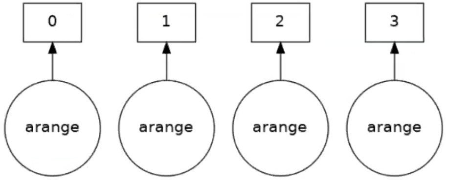

## Dask

Dask is a framework that covers many things which were not possible even a few years ago. It allows us to create 
multiple tasks with a minimum of effort. There are different aspects to Dask of which we will cover just a few during
this lesson. Dask is integrated with different projects such as `pandas`, `numpy` and `scipy`. This allows 
parallelisation of for example `scipy` functions with minimum changes to the python code. Some of the projects have
their own multithreaded functions, so Dask is not essential.

Dask can work very well in notebook environments, as it gives you a good visual representation as to what is going on.
You can open up the [notebook](../files/06-Dask/06-Dask_Array.ipynb) for this episode.

We will first look at "Dask Distributed". The first step is to create a set of workers with a scheduler. Here we are
creating 2 "worker" processes with 2 threads each. This means that we can assign a particular task to a specific 
worker. There will be 1GB for all workers.

~~~
import dask
from dask.distributed import Client

client = Client(n_workers=2, threads_per_worker=2, memory_limit='1GB')

client
~~~
{: .language-python}

The `Client` function is needed here to set up a variable which we will call lowercase `client`. It is worth noting 
that this is running on a login node, hence the memory size is small as we do not want to stress the system. As you can
see upon running the cell with (using the correct environment) your output will be very different to what you may 
expect.

It will display some information about:

Client:
- Connection Method
- Cluster type
- Dashboard

And in the dropdown menu on **Cluster Info**:
Local Cluster
- Dashboard `http://127.0.0.1:12345/status`
- Total threads: 4
- Status: running
- Workers: 2
- Total memory: 1.86 GiB
- Using processes: True

And in the second drop down menu about the scheduler
Scheduler
- Comm: `...`
- Dashboard: `http://127.0.0.1:12345/status`
- Started: just now
- Workers: 2
- Total threads: 4
- Total memory: 1.86 GiB

Further information is then displayed about the two workers. This information is not essential, but can help you 
understand what is being set up.

Clicking the link in **Dashboard** will not work on its own. To deal with this you would need to set up an ssh tunnel
through the machine that you are using the terminal.

~~~
$ ssh -N -L 8787:localhost:12345 youraccount@login1@kay.ichec.ie
~~~
{: .language-bash}

You may be using Jupyter notebook already, which will be taking up the port `8080`, so we can change that in the 
terminal to `8787` as shown above. The second thing to change is the port that is being used on your host/machine. If 
you look up at the Dashboard link, the final 5 numbers will show the port, in this case `12345`. Yours may show up
differently.

Upon entering the required passwords, your tunnel is set up and you can view your Dashboard. Entering `localhost:8787`
into your web browser will produce something similar to below.

If you are doing debugging of your system and seeing what is going on with load balancing, then this can be very 
useful, giving you the amount of memory per worker and so on. If your program exceeds the memory usage specified in the
code, then naturally, you will get some errors.

> ## Dask Dashboard
>
> Ensure that you have followed the above steps and take some time to explore around the Dashboard. What do you think
> everything means, and how can you best utilise them?
>
{: .challenge}

The alternative to the above method is to install jupyter-server-proxy. 

Once we are finished with this we need to close the client, and therefore you will stop the workers.

~~~
client.close()
~~~
{: .language-python}

Using this type of cluster will however restrict you to a single node of your machine. We can use more than one node
later on.

Here we have a simple example where we estimate pi. This version uses numpy functions to perform the calculations. 
Note there are no explicit loops. The code is serial. We are instead setting up an array, setting it up where we are 
asked for the size of array that we want to use. As the array gets bigger, our estiamte of pi will improve. As we are
using NumPy to make it more efficient, we don't necessarily need any loops.

~~~
import numpy as np

def calculate_pi(size_in_bytes):
    
    """Calculate pi using a Monte Carlo method."""
    
    rand_array_shape = (int(size_in_bytes / 8 / 2), 2)
    
    # 2D random array with positions (x, y)
    xy = np.random.uniform(low=0.0, high=1.0, size=rand_array_shape)
    
    # check if position (x, y) is in unit circle
    xy_inside_circle = (xy ** 2).sum(axis=1) < 1

    # pi is the fraction of points in circle x 4
    pi = 4 * xy_inside_circle.sum() / xy_inside_circle.size

    print(f"\nfrom {xy.nbytes / 1e9} GB randomly chosen positions")
    print(f"   pi estimate: {pi}")
    print(f"   pi error: {abs(pi - np.pi)}\n")
    
    return pi
~~~
{: .language-python}

~~~
%time calculate_pi(10000)
~~~
{: .language-python}

~~~
from 1e-05 GB randomly chosen positions
   pi estimate: 3.072
   pi error: 0.06959265358979305

CPU times: user 2.06 ms, sys: 1.44 ms, total: 3.5ms
Wall time: 2.78 ms

3.072
~~~
{: .output}

Without needing to change the function we can use Dask to parallelise the work. In this case we have two workers. The
`dask.delayed` creates a task graph, which creates the tasks that have to be run, if there are more than 2, they need
to be set to run using the scheduler until all tasks are complete. This doesn't run the task itself however.

The running of the tasks itself is done using `dask.compute`

~~~
client = Client(n_workers=2, threads_per_worker=2, memory_limit='1GB')
dask_calpi = dask.delayed(calculate_pi)(10000)
~~~
{: .language-python}

> ## Runtime with Dask
>
> Check the output of the line below.
> 
> ~~~
> %time dask.compute(dask_calpi)
> ~~~
> {: .language-python}
> 
> Is this what you would expect? Why?
> 
> > ## Result 
> >
> > ~~~
> > CPU times: user 195 ms, sys: 343 ms, total: 538 ms
> > Wall time: 546 ms
> > (3.1488,)
> > ~~~
> > {: .output}
> >
> > You should find that it is taking longer with Dask! You can change the size of the problem but still find that Dask
> > is slower. This is because we are using Dask incorrectly, the function cannot be divided into tasks. There are also
> > a lot of overheads, which can still slow things down more.
> {: .solution}
{: .challenge}

We can visualise how the tasks are decomposed with the `visualize` function.

~~~
dask.visualize(dask_calpi)
~~~
{: .language-python}

You will get an output similar to below, which shows we are only using 1 task. We need to split our workload into 
multiple tasks.

We can only get task parallelism if we call the function more than once. Below is an example of this.

~~~
results = []
for i in range(5):
    dask_calpi = dask.delayed(calculate_pi)(10000*(i+1))
    results.append(dask_calpi)
    
dask.visualize(results)

#to run all the tasks use
#dask.compute(*results)
~~~
{: .language-python}

Running this will produce the following output, now with 5 tasks.

> ## Continuing with Pi calculation
>
> Run the same `calculate_pi` function for array sizes 1GB-5GB. Time the numpy only version against when using dask. Do
> you notice anything? Modify the codes in the [notebook](../files/06-Dask/exercises/06-Dask_Array_Exercise1.ipynb)
> and submit to the queue.
> 
> You should have 5 different runs, 1GiB, 2GiB, 3GiB, 4GiB and 5GiB. 
> 
> > ## Solution
> > 
> > ~~~
> > import dask
> > from dask.distributed import Client
> > import numpy as np
> > import time
> > 
> > def calculate_pi(size_in_bytes):
> >     
> >     """Calculate pi using a Monte Carlo method."""
> >     
> >     rand_array_shape = (int(size_in_bytes / 8 / 2), 2)
> >     
> >     # 2D random array with positions (x, y)
> >     xy = np.random.uniform(low=0.0, high=1.0, size=rand_array_shape)
> >     
> >     # check if position (x, y) is in unit circle
> >     xy_inside_circle = (xy ** 2).sum(axis=1) < 1
> > 
> >     # pi is the fraction of points in circle x 4
> >     pi = 4 * xy_inside_circle.sum() / xy_inside_circle.size
> > 
> >     print(f"\nfrom {xy.nbytes / 1e9} GB randomly chosen positions")
> >     print(f"   pi estimate: {pi}")
> >     print(f"   pi error: {abs(pi - np.pi)}\n")
> >     
> >     return pi
> > 
> > if __name__ == '__main__':
> > 
> > # Numpy only version
> >     t0 = time.time()
> >     for i in range(5):
> >        pi1 = calculate_pi(1000000000*(i+1))
> >     t1 = time.time()
> >     print(f"time taken for nupmy is {t1-t0}\n\n")
> > 
> > # Dask version
> >     client = Client(n_workers=5, threads_per_worker=1, memory_limit='50GB')
> >     client
> > 
> >     t0 = time.time()
> >     results = []
> >     for i in range(5):
> >        dask_calpi = dask.delayed(calculate_pi)(1000000000*(i+1))
> >        results.append(dask_calpi)
> >     dask.compute(*results)
> >     t1 = time.time()
> >     print("time taken for dask w5/t1 is " + str(t1-t0))
> > 
> >     client.close()
> > ~~~
> > {: .language-python}
> >
> {: .solution}
{: .challenge}

## Dask Array

From the previous example parallelisation comes with a downside. If we have 1 task that needs 10GB memory, having 10 
simultaneously will need 100GB in total. Each Kay node has 180GB of memory, what if we need more than that? Dask Array
splits a larger array into smaller chunks. We can work on larger than memory arrays but still use all of the cores.
You can think of the Dask array as a set of smaller numpy arrays.

Below we have some simple examples of using dask arrays. Again we need to setup a LocalCluster.

~~~
client = Client(n_workers=2, threads_per_worker=1, memory_limit='1GB')
client

import dask.array as da
~~~
{: .language-python}

**These examples courtesy of Dask contributor James Bourbeau**

~~~
a_np = np.arange(1, 50, 3)   # Create array with numbers 1->50 but with a stride of 3
print(a_np)
a_np.shape
~~~
{: .language-python}

~~~
[ 1 4 7 10 13 16 19 22 25 28 31 34 37 40 43 46 49]
(17,)
~~~
{: .output}

That's the NumPy version. For dask we will set up an array of the same size, but in chunks of size = 5.

~~~
a_da = da.arange(1, 50, 3, chunks=5)
a_da
~~~
{: .language-python}

As an output we get a diagram.

Notice that we split the 1D array into 4 chunks with a maximum size of 5 elements. Also that Dask is smart enough to 
have setup a set of tasks.

~~~
print(a_da.dtype)
print(a_da.shape)
print(a_da.chunks)
print(a_da.chunksize)
~~~
{: .language-python}

~~~
int64
(17,)
((5, 5, 5, 2),)
(5,)
~~~
{: .output}

As before we can visualise this task graph

~~~
a_da.visualize()
~~~
{: .language-python}

Four tasks have been created for each of the subarrays. Take an operation where the tasks are independent. When the
array is created it will be executed in parallel. Now say we want to square the elements of the array, and look at the
task graph of that

~~~
(a_da ** 2).visualize()
~~~
{: .language-python}

Up to now we have only been setting up the task graph or how the workload is split. Remember, we haven't actually done
anything yet. To actually perform the set of tasks we need to *compute* the result.

~~~
(a_da ** 2).compute()
~~~
{: .language-python}

~~~
array([   1,   16,  100,  169,  256,  361,  484,  625,  784,  961, 
       1156, 1369, 1600, 1849, 2116, 2401])
~~~
{: .output}

You can see that the parallelisation is easy, you don't really need to understand the parallelisation strategy or
anything at all! A numpy array is returned. There are other operations that can be done.

Dask arrays support a large portion of the NumPy interface such as:
- Arithmetic and scalar mathematics: `+`, `*`, `exp`, `log`, ...
- Reductions along axes: `sum()`, `mean()`, `std()`, `sum(axis=0)`, ...
- Tensor contractions / dot products / matrix multiply: `tensordot`
- Axis reordering / transpose: `transpose`
- Slicing: `x[:100, 500:100:-2]`
- Fancy indexing along single axes with lists or numpy arrays: `x[:, [10, 1, 5]]`
- Array protocols like `__array__` and `__array_ufunc__`
- Some linear algebra: `svd`, `qr`, `solve`, `solve_triangular`, `lstsq`, ...

See the [Dask array API docs](http://docs.dask.org/en/latest/array-api.html) for full details about what portion of the
NumPy API is implemented for Dask arrays. You may not be able to do everything on your machine, so check to see what
you and your machine are capable of.

### Blocked Algorithms

Dask arrays are implemented using blocked algorithms. These algorithms break up a computation on a large array into 
many computations on smaller pieces of the array. This minimizes the memory load (amount of RAM) of computations and
allows for working with larger-than-memory datasets in parallel. Dask supports a large protion of the numpy functions.

The below will generate a random array, and it will automatically create the tasks, and from there the sums will be
parallelised. This is similar to what you would see in MPI, but obviosuly much easier to implement

~~~
x = da.random.random(20, chunks=5)
# Sets up the computation
result = x.sum()
# result.visualize()
result.compute()
~~~
{: .language-python}

~~~
9.83769173433889
~~~
{: .output}

When you run the above (uncomment to visualise it), it will be more complex than before, but it is creating the numpy
array and doing the partial sums, followed by an aggregate and therefore giving you the answer. We haven't really done 
much at all, but have still created a fairly complex set up.

> ## A more complex example
> 
> Change the size to a 15x15 array and create a chunks array of size `10, 5`. Repeat the above steps, but do it with
> as the transpose of a matrix, `x + x.T`.
> 
> > ## Solution
> > 
> > ~~~
> > x = da.random.random(size=(15, 15), chunks=(10, 5))
> > x.chunks
> > result = (x + x.T).sum()
> > result.visualize()
> > result.compute()
> > ~~~
> > {: .language-python}
> > 
> > ~~~
> > 222.71576130946
> > ~~~
> > {: .output}
> > 
> > The task graph will look a mess, but who cares! It's done it for us! Don't forget to close your client!
> {: .solution}
{: .challenge}

We can perform computations on larger-than-memory arrays!

~~~
client.restart()
client.close()
~~~
{: .language-python}

## Calculate pi

Going back to the previous example, calculating pi, how can we go about parallelising the function itself. Well, we 
could use dask arrays rather than numpy.

So let's change our 2D random array, `xy`, and specify the number of chunks in our function.

~~~
def dask_calculate_pi(size_in_bytes,nchunks):
    
    """Calculate pi using a Monte Carlo method."""
    
    rand_array_shape = (int(size_in_bytes / 8 / 2), 2)
    chunk_size = int(rand_array_shape[0]/nchunks)
    
    # 2D random array with positions (x, y)
    xy = da.random.uniform(low=0.0, high=1.0, size=rand_array_shape, chunks=chunk_size)
    print(xy)
    
    # check if position (x, y) is in unit circle
    xy_inside_circle = (xy ** 2).sum(axis=1) < 1

    # pi is the fraction of points in circle x 4
    pi = 4 * xy_inside_circle.sum() / xy_inside_circle.size
    
    # Do the computation
    result = pi.compute()

    print(f"\nfrom {xy.nbytes / 1e9} GB randomly chosen positions")
    print(f"   pi estimate: {result}")
    print(f"   pi error: {abs(result - np.pi)}\n")
    
    return result
~~~
{: .language-python}

~~~
client = Client(n_workers=5,threads_per_worker=1,memory_limit='1GB')
client
%time dask_calculate_pi(10000000,20)
~~~
{: .language-python}

~~~
dask.array<uniform, shape=(625000, 2), dtpye=float64, chunksize=(31250, 2), chunktype=numpy.ndarray>

from 0.01 GB randomly chosen positions
   pi estimate: 3.146176
   pi error: 0.004583346410206968

CPU times: user 486 ms, sys: 176 ms, total: 662 ms
Wall time: 2.34 s

3.146176
~~~
{: .output}

> ## Calculating Pi Part 2
> 
> Using dask arrays expand the pi calculation to use a 100GB array. This is still smaller than the total memory per
> node (~180GB). We should be careful in deciding the memory per worker and threads per worker. Modify the code 
> found in the [notebook](../files/06-Dask/exercises/06-Dask_Array_Exercise2.ipynb) and submit on the compute nodes.
>
> You will need to start the client and run the function.
>
> > ## Solution
> > 
> > ~~~
> > import numpy as np
> > import dask
> > import dask.array as da
> > from dask.distributed import Client
> > import time
> > 
> > def dask_calculate_pi(size_in_bytes,nchunks):
> >     
> >     """Calculate pi using a Monte Carlo method."""
> >     
> >     rand_array_shape = (int(size_in_bytes / 8 / 2), 2)
> >     chunk_size = int(rand_array_shape[0]/nchunks)
> >     print(chunk_size)
> >     
> >     # 2D random array with positions (x, y)
> >     xy = da.random.uniform(low=0.0, high=1.0, size=rand_array_shape, chunks=chunk_size)
> >     print(f" Created xy\n {xy}\n")
> >     print(f" Number of partitions/chunks is {xy.numblocks}\n")
> >     
> >     # check if position (x, y) is in unit circle
> >     xy_inside_circle = (xy ** 2).sum(axis=1) < 1
> > 
> >     # pi is the fraction of points in circle x 4
> >     pi = 4 * xy_inside_circle.sum() / xy_inside_circle.size
> >     
> >     result = pi.compute()
> > 
> >     print(f"\nfrom {xy.nbytes / 1e9} GB randomly chosen positions")
> >     print(f"   pi estimate: {result}")
> >     print(f"   pi error: {abs(result - np.pi)}\n")
> >     
> >     return result
> > 
> > if __name__ == '__main__':
> > 
> >     client = Client(n_workers=5, threads_per_worker=4, memory_limit='40GB')
> >     print(client)
> > 
> >     t0 = time.time()
> >     dask_calculate_pi(100000000000,40)
> >     t1 = time.time()
> >     print("time taken for dask is " + str(t1-t0))
> > 
> >     client.close()
> > ~~~
> > {: .language-python}
> {: .solution}
{: .challenge}

Feel free to investigate some of the links below.

__[Dask Home Page](http://dask.org)__

__[Dask Distributed](https://distributed.dask.org/en/stable/)__

__[Dask Array](https://docs.dask.org/en/stable/array.html)__

## Dask MPI

Up to now with Dask we have been using a single node. The local cluster is like multi-threading, which, by its nature
will not work on across multiple nodes. The issue is how the workers comminucate with the scheduler. As we have seen we
can use multiple nodes using MPI. Dask MPI is built on top of `mpi4py`.

When we operate Dask MPI there is another part of the framework that instead of threads, splits the scheduler and 
workers over MPI processes. The processes are laid out as follows:

- Rank 0 runs the scheduler.
- Rank 1 runs the python script.
- Ranks 2 and above are the workers.

To illustrate how this is done we will use the previous example. Below is the complete python code, and we only need
to import one more package, `dask_mpi`. The function itself is unchanged from last time when we used dask arrays.

~~~
import numpy as np

import dask
import dask.array as da
from dask.distributed import Client
from dask_mpi import initialize
import time

def dask_calculate_pi(size_in_bytes,nchunks):
    
    """Calculate pi using a Monte Carlo method."""
    
    rand_array_shape = (int(size_in_bytes / 8 / 2), 2)
    chunk_size = int(rand_array_shape[0]/nchunks)
    print(chunk_size)
    
    # 2D random array with positions (x, y)
    xy = da.random.uniform(low=0.0, high=1.0, size=rand_array_shape, chunks=chunk_size)
    print(f" Created xy\n {xy}\n")
    print(f" Number of partitions/chunks is {xy.numblocks}\n")
    
    
    # check if position (x, y) is in unit circle
    xy_inside_circle = (xy ** 2).sum(axis=1) < 1

    # pi is the fraction of points in circle x 4
    pi = 4 * xy_inside_circle.sum() / xy_inside_circle.size
    
    result = pi.compute()

    print(f"\nfrom {xy.nbytes / 1e9} GB randomly chosen positions")
    print(f"   pi estimate: {result}")
    print(f"   pi error: {abs(result - np.pi)}\n")
    
    return result

if __name__ == '__main__':
    initialize(nthreads=4,memory_limit='40GB')

    client = Client()

    t0 = time.time()
    print(client)
    dask_calculate_pi(100000000000,40)
    t1 = time.time()
    print("time taken for dask is " + str(t1-t0))
    
    close.client()
~~~
{: .language-python}

The changes come in the main body of the code, when we come to initialise it. You will still need to initialise the 
scheduler and workers by calling `Client`. However this time it is called without any arguments. The system of MPI
processes is created by calling `intialize`. You can see that the parameters are setup at this call and not through
`Client()`. One thing you may notice is that the number of workers has not been set. This is set at execute time.

Below is an example slurm script, from which we can set the number of workers. 

~~~
#!/bin/bash
#SBATCH --nodes=2
#SBATCH --time=01:00:00
#SBATCH -A $ACCOUNT
#SBATCH --job-name=calpi
#SBATCH -p $PARTITION
#SBATCH --reservation=$RESERVATION

module purge
module load conda openmpi/gcc/3.1.2
module list

source activate /ichec/home/users/course00/conda_HPC

cd $SLURM_SUBMIT_DIR

mpirun -n 6 -npernode 3 python -u dask_MPI_calculate_pi.py

exit 0
~~~
{: .language-bash}

The number of workers has been set by the number of processes we create. In this case it is 4 because rank 0 is the
scheduler and rank 1 runs the python script. The workers come into play when there are parallel tasks to run. Just to
prove that it will work over multiple nodes we have asked for 3 processes to run per node. This version is not faster
than using plain Dask but it allows more memory per worker.

The output will come in a slurm output, and there will be a lot of material in the output file in addition to the 
result.

> ## Prove it!
>
> Run the above to make sure that it all works. Remember that you cannot run this example through the notebook. Be sure
> to run the slurm script and specify the account, partition and reservation outlined to you by your instructor.
>
{: .challenge}


