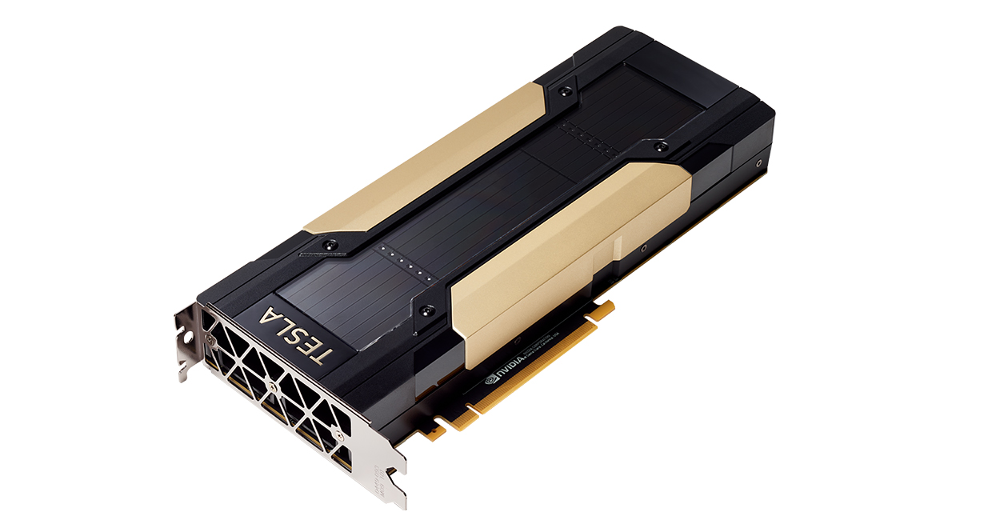
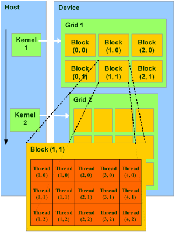
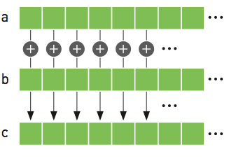
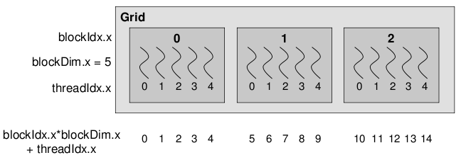

## Basics of GPUs

If you're taking this course, it is quite probable that you have never come across GPUs before. This section will help
give an overview into one of the most important bits of hardware in computing. A GPGPU is a device that is external to
the machine CPU but can perform computation. The benefits of using a GPU is that it has many more cores (thousands!) 
than a CPU which are more efficient at particular operations. ICHEC's cluster, Kay, has Tesla VT100 which have 5120
CUDA cores. This is a stark comparison to a node on Kay, which only has 40 CPU cores.

These cores are arranged in streaming multiprocessors (SM) of which there are 80. The downsides are that GPU cores are 
not as flexible as CPU cores. Data needs to be moved between CPU and GPU memory, increasing overheads. The memory per
GPU core is tiny compared to that of the CPU. The total memory of a Tesla VT100 is only 16 GiB. So you need to be very
conscious of how you use the memory in any code that you write on a GPU.

GPGPUs are best when performing SIMD (single input, multiple data) calculations, due to the fact that groups of cores
can only perform a single instruction at any one time.

## CUDA Basics

CUDA is not a language in itself but are extensions to C. Similar to MPI where an individual process runs on an
individual core, the same applies here, as does the fact that the code runs the same on each process. There is a 
single source code which defines which computation is done on the CPU and which on the GPU. The CPU controls the flow
of the execution. The CPU is called the **host** and the GPU the **device**.

The host runs C functions defined the same way as normal. The device runs what are called kernels which are similar 
to C functions. The execution model is thread based similar to OpenMP. Each kernel has a grid and grids are organised
into blocks. Each block has a number of threads. One block is executed on a single SM, so there is a maximum number of
threads a block can have. These constructions can be 1D,2D, or 3D. The example below is a 2D grid.

> ## How to explore your GPU
> 
> For each GPU node on Kay there are 2 Tesla VT100s which have 16GB memory each. One way to access the GPUs from Python
> is by using the package `pycuda`. Through this we can examine them. The login nodes do not have GPUs, so we need to 
> submit the script below to the `GpuQ`. 
>
> Take a note of the command used and submit it to the `GpuQ`. What does the output look like? What are the most 
> important lines in the output?
>
> ~~~
> import pycuda.driver as drv
> 
> drv.init()
> drv.get_version()
> 
> devn = drv.Device.count()
> print ('Localized GPUs =',devn)
> 
> sp = drv.Device(0)
> 
> print ('Name = ',sp.name())
> print ('PCI Bus = ',sp.pci_bus_id())
> print ('Compute Capability = ',sp.compute_capability())
> print ('Total Memory = ',sp.total_memory()/(2.**20) , 'MBytes')
> attr = sp.get_attributes()
> for j in range(len(attr.items())):
>    print (list(attr.items())[j])#,'Bytes (when apply)'
> print ('------------------')
> print ('------------------')
> ~~~
> {: .language-python}
> 
> ~~~
> #!/bin/bash
> #SBATCH --nodes=1
> #SBATCH --time=00:10:00
> #SBATCH -A $ACCOUNT
> #SBATCH --job-name=test
> #SBATCH -p GpuQ
> #SBATCH --reservation=$RESERVATION
> 
> module purge
> module load conda cuda/11.4 gcc/8.2.0
> module list
> 
> source activate /ichec/home/users/course00/conda_HPC
> 
> cd $SLURM_SUBMIT_DIR
> 
> python -u gpu_test.py
> 
> exit 0
> ~~~
> {: .language-bash}
> 
> > ## Output
> >
> > Below is the output from this script. We have highlighted a few of the key items have been extracted. You can see
> > the maximum block and grid sizes. Notice that there is a maximum number of threads per block. At the bottom you can
> >  see the wrap size. Threads in a wrap are constrained to run the same instruction/operation at any one time. Block
> > sizes should be a multiple of the wrap size.
> > 
> > ~~~
> > Name =  Tesla V100-PCIE-16GB
> > PCI Bus =  0000:5E:00.0
> > Compute Capability =  (7, 0)
> > Total Memory =  16130.5 MBytes
> > (pycuda._driver.device_attribute.ASYNC_ENGINE_COUNT, 7)
> > ...
> > (pycuda._driver.device_attribute.MAX_BLOCK_DIM_X, 1024)                          
> > (pycuda._driver.device_attribute.MAX_BLOCK_DIM_Y, 1024)                          
> > (pycuda._driver.device_attribute.MAX_BLOCK_DIM_Z, 64)                           
> > (pycuda._driver.device_attribute.MAX_GRID_DIM_X, 2147483647)                   
> > (pycuda._driver.device_attribute.MAX_GRID_DIM_Y, 65535)                       
> > (pycuda._driver.device_attribute.MAX_GRID_DIM_Z, 65535)             
> > ...
> > (pycuda._driver.device_attribute.MAX_THREADS_PER_BLOCK, 1024)      
> > ...
> > (pycuda._driver.device_attribute.WARP_SIZE, 32)          
> > ~~~
> > {: .output}
> >
> > The main things to point out are the `MAX_BLOCK_DIM`, and `MAX_GRID_DIM`, which are the maximum size of the blocks
> > and the grid sizes that you can have in all dimensions. Additionally is the `MAX_THREADS_PER_BLOCK`, which will
> > limit the size of the block. The `WARP_SIZE` is important as it means that the number of CUDA cores are split into
> > 32 core blocks and each thread within the block/unit need to work on a single instruction. 32 cores are 
> > "tied togethter" throughout the GPU. When designing your blocks, you want to make sure that they are a multiple of
> > the `WARP_SIZE` (64, 96, 128, 160, 320, 640, 1024, etc) to ensure the code is efficient.
> >
> {: .solution}
{: .challenge}

## Vector addition

A typical example of using a GPU to perform work is vector addition. This is a trivially parallelizable example 
because the operation for each element of the array is independent. We will look at how this is done in C.

~~~
#include <stdio.h>
#include <stdlib.h>

int main(void)
{
    int N = 10;
    float *a,*b,*c;

    // Reserve memory
    a = (float *) malloc(N * sizeof(float));
    b = (float *) malloc(N * sizeof(float));
    c = (float *) malloc(N * sizeof(float));

    // Initialize arrays
    for (int i = 0; i < N; ++i){
        a[i] = i;
        b[i] = 2.0f;	
    }

    // Perform vector addition
    for (int i = 0; i < N; ++i){
        c[i]= a[i]+b[i];	
    }

    printf("Done %f\n",c[0]);

    // Free arrays
    free(a); free(b); free(c);
    return 0;
}
~~~
{: .language-c}

Don't worry if your C knowledge isn't up to scratch, but the main points are as follows:

- We need to reserve the memory for `a`, `b`, and `c` in the CPU to hold the arrays, of size `N`
- Initialise the arrays
- Perform our vector addition
- Free the memory that we have reserved. 

An individual thread is identified through the block ID and the thread ID within the block. In the example below, 
which is 1-dimensional (1x5), we have 3 blocks and 15 threads each. Within each block our `threadIdx` are 0-4. To get
the global `threadId` we need to perform the sum as shown.

Below is the CUDA version of vector addition. The `vectorAdd` function is the CUDA kernel. Notice that there is no for
loop. It is written as if for a single thread. A single threads adds a single element, that element is determined by 
the thread and block IDs.

To compile this code we use `nvcc`.

~~~
#include <stdio.h>
#include <stdlib.h>
#include <cuda_runtime.h>
// CUDA Kernel
__global__ void vectorAdd(const float *A, const float *B, float *C, int numElements)
{
    int i = blockDim.x * blockIdx.x + threadIdx.x;
    if (i < numElements)
    {
        C[i] = A[i] + B[i];
    }
}

/*
 * Host main routine
 */
int main(void)
{
    int numElements = 15;
    size_t size = numElements * sizeof(float);
    printf("[Vector addition of %d elements]\n", numElements);

    float *a,*b,*c;
    float *a_gpu,*b_gpu,*c_gpu;

    // Reserve host memory
    a = (float *) malloc(size);
    b = (float *) malloc(size);
    c = (float *) malloc(size);
    
    // Reserve device memory
    cudaMalloc((void **)&a_gpu, size);
    cudaMalloc((void **)&b_gpu, size);
    cudaMalloc((void **)&c_gpu, size);

    // Initialize arrays
    for (int i=0;i<numElements;++i ){
    	a[i] = i;
    	b[i] = 2.0f;
    }
    
    // Copy the host input vectors A and B in host memory to the device input vectors in
    // device memory
    printf("Copy input data from the host memory to the CUDA device\n");
    cudaMemcpy(a_gpu, a, size, cudaMemcpyHostToDevice);
    cudaMemcpy(b_gpu, b, size, cudaMemcpyHostToDevice);

    // Launch the Vector Add CUDA Kernel
    int threadsPerBlock = 256;
    int blocksPerGrid =(numElements + threadsPerBlock - 1) / threadsPerBlock;
    printf("CUDA kernel launch with %d blocks of %d threads\n", blocksPerGrid, threadsPerBlock);
    vectorAdd<<<blocksPerGrid, threadsPerBlock>>>(a_gpu, b_gpu, c_gpu, numElements);

    // Copy the device result vector in device memory to the host result vector
    // in host memory.
    printf("Copy output data from the CUDA device to the host memory\n");
    cudaMemcpy(c, c_gpu, size, cudaMemcpyDeviceToHost);

    for (int i=0;i<numElements;++i ){
    	printf("%f \n",c[i]);
    }

    // Free host memory
    free(a); free(b); free(c);
    
    // Free device global memory
    cudaFree(a_gpu);
    cudaFree(b_gpu);
    cudaFree(c_gpu);
    
    printf("Done\n");
    return 0;
}
~~~
{: .language-cuda}

In the example above we have an array of length = 15, we reserve the memory on the GCPU then on the GPU as they are two
distinct memories. We copy over the data from the GPU over to the GPU for `a` and `b` from host (CPU) to device (GPU).
The device is the one that does the vector addition, and stores the result in `c_gpu`. We then copy that back from the
device to the host. It's a bit more complex now with CUDA, then we free the memory on the CPU and GPU. 

The functions are also different and defined in the CUDA environment. The other thing to note is that the GPU kernel 
itself is defined by `__global__ void vectorAdd(...)`. We give it the `a`, `b` and `c` vectors as well as the number of
elements. There is no loops in the code, and we are writing it as if for a single thread. But the thing we need to make
sure of is which thread is working on which element of the array, and that they only work on a single element of the
array. If we have more threads than number of elements, we also need to check for that as well.

## PyCUDA

So far we have been using the GPUs through cuda code. PyCUDA is a framework which allows us to access the GPU form a
python environment. There are different ways to achieve this. First we will look at GPUArrays, as we can copy arrays
from the host to device, perform basic operations then return the data to the host.

The code below does the same as those above. Much of the work is hidden, like python itself. Also you can view the 
data both on the CPU and GPU. The distinction between what is on the GPU and CPU is blurred which may cause problems.

~~~
from pycuda import autoinit
from pycuda import gpuarray
import numpy as np

# Create single precision host arrays
aux = range(15)
a = np.array(aux).astype(np.float32)
b = 2.0*np.ones(len(aux),dtype=np.float32)

# Create and copy data to GPU 
a_gpu = gpuarray.to_gpu(a)
b_gpu = gpuarray.to_gpu(b)

# Perform operation on GPU
aux_gpu = a_gpu+b_gpu

# Return data to host
c = aux_gpu.get()

print("a_gpu=")
print(a_gpu)

print("b_gpu=")
print(b_gpu)

print("aux_gpu=")
print(type(aux_gpu))
print(aux_gpu)

print("c=")
print(type(c))
print(c)

# Free memory on GPU - 2 methods
del(a_gpu)
b_gpu.gpudata.free()
~~~
{: .language-python}

This code cannot be run in notebooks, so the terminal is essential here.

> ## PyCUDA
>
> Run the above code by submitting it to the `GpuQ`.
>
{: .challenge}

## Using source code

The second way to go about doing it is to use the CUDA kernel that we created, rather than turning it into Python. You
may have a CUDA code, but would prefer if it stayed in CUDA which you can then use. However notice that we are only
using the kernel.

~~~
from pycuda import autoinit
from pycuda import gpuarray
import pycuda.driver as drv
import numpy as np
from pycuda.compiler import SourceModule

# Read in source code
cudaCode = open("vecadd.cu","r")
myCUDACode = cudaCode.read()
myCode = SourceModule(myCUDACode)

# Extract vectorAdd kernel
importedKernel = myCode.get_function("vectorAdd")

# Create host arrays
aux = range(15)
a = np.array(aux).astype(np.float32)
b = 2.0*np.ones(len(aux),dtype=np.float32)
c = np.zeros(len(aux),dtype=np.float32)

# Create and copy data to GPU, need to three arrays as there are three arguments to vectorAdd 
a_gpu = gpuarray.to_gpu(a)
b_gpu = gpuarray.to_gpu(b)
c_gpu = gpuarray.to_gpu(c)

# Set grid/block properties
threadsPerBlock = 256
blocksPerGrid = (len(aux) + threadsPerBlock - 1) / threadsPerBlock;

# Perform operation
# Need to give the number of blocks per grid in 3D
# Need to give block size in 3D
importedKernel(a_gpu.gpudata,b_gpu.gpudata,c_gpu.gpudata,block=(threadsPerBlock,blocksPerGrid,1),grid=(1,1,1))

# Wait for computation to finish
drv.Context.synchronize()

# 
c = c_gpu.get()
print(c=")
print(c)
~~~
{: .language-python}

We can grab the kernel `vectorAdd` from our CUDA code, and then we do similar to what was done previously, creating our 
"post-arrays", as well as our empty `c` array. We then copy those over as we need to make space on the GPU as before. 
We also need to create the number of threads per block, which is effectively creating our grid. If you recall, in
previous cases we didn't need to bother with that. We then call our imported kernel, and can run it this way, adding 
the arguments for the GPU, block size etc. We then get our result back again. As you can see, there is more coding 
to be done than the first approach using GPUArrays only. But might be necessary for more complex kernels.

> ## Using source code
>
> Run the above code by submitting it to the `GpuQ`.
>
{: .challenge}

## Elementwise Kernels

Yet another way is to use a predefined function `ElementwiseKernel`.

As its name suggests it performs operations that are trivially parallel across the array.

There are other similar pyCUDA functions.

~~~
from pycuda import autoinit
from pycuda import gpuarray
import numpy as np
from pycuda.elementwise import ElementwiseKernel

# Create host arrays
aux = range(15)
a = np.array(aux).astype(np.float32)
b = 2.0*np.ones(len(aux),dtype=np.float32)
c = np.zeros(len(aux),dtype=np.float32)

# Create and copy data to GPU, need to three arrays as there are three arguments to vectorAdd 
a_gpu = gpuarray.to_gpu(a)
b_gpu = gpuarray.to_gpu(b)
c_gpu = gpuarray.to_gpu(c)

# Create the function that does vector addition in this case
myCudaFunc = ElementwiseKernel(arguments = "float *a, float *b, float *c",
                               operation = "c[i] = a[i]+b[i]",
                               name = "myVecAdd")
# Execute function
myCudaFunc(a_gpu,b_gpu,c_gpu)

# Return data to host
c = c_gpu.get()

print("c =")
print(c)

# Free memory on GPU
a_gpu.gpudata.free()
b_gpu.gpudata.free()
c_gpu.gpudata.free()
~~~
{: .language-python}

These once again will only work for things like vector addition. The method is similar, but we need to define the
arguments to the functions and is generated through the ElementwiseKernel function itself. This approach may run into
difficulties for more complex kernels.

> ## Using `ElementwiseKernal`
>
> Run the above code by submitting it to the `GpuQ`.
>
{: .challenge}

## Dask GPU

So that is how to use GPUs the hard way. Thankfully we can use Dask, which makes it much easier to use. However, it is
in its early stages of development. It is very easy to setup.

Let us use the example we had previously calculating pi. The only difference is that we setup a LocalCUDACluster. This
then uses both GPUs as the workers.

Our example we have here is much slower than the CPU version. Some example will work better than others, but it is 
clear that specific problems will be accelerated using this approach.

But using Dask array we have been able to work on an array much larger than the GPU memory, so although this example
can technically work, having an understanding of memory usage will be important when dealing with problems like this. 

~~~
import numpy as np

import dask
import dask.array as da
from dask.distributed import Client
from dask_cuda import LocalCUDACluster         # Added

import time

def dask_calculate_pi(size_in_bytes,nchunks):
    
    """Calculate pi using a Monte Carlo method."""
    
    rand_array_shape = (int(size_in_bytes / 8 / 2), 2)
    chunk_size = int(rand_array_shape[0]/nchunks)
    print(chunk_size)
    
    # 2D random array with positions (x, y)
    xy = da.random.uniform(low=0.0, high=1.0, size=rand_array_shape, chunks=chunk_size)
    print(f" Created xy\n {xy}\n")
    print(f" Number of partitions/chunks is {xy.numblocks}\n")
    
    
    # check if position (x, y) is in unit circle
    xy_inside_circle = (xy ** 2).sum(axis=1) < 1

    # pi is the fraction of points in circle x 4
    pi = 4 * xy_inside_circle.sum() / xy_inside_circle.size
    
    result = pi.compute()

    print(f"\nfrom {xy.nbytes / 1e9} GB randomly chosen positions")
    print(f"   pi estimate: {result}")
    print(f"   pi error: {abs(result - np.pi)}\n")
    
    return result

if __name__ == '__main__':

    cluster = LocalCUDACluster()             # Added
    print(cluster)
    
    client = Client(cluster)
    print(client)

    t0 = time.time()
    dask_calculate_pi(100000000000,40)
    t1 = time.time()
    print("time taken for dask is " + str(t1-t0))

    client.restart()
    client.close()
~~~
{: .language-python}

We need to add a line that sets up the cluster as a `LocalCUDACluster()`, the client, then we run our code and get 
the result at the end.

> ## Using `ElementwiseKernal`
>
> Run the above code by submitting it to the `GpuQ`.
>
{: .challenge}

Although it is clear that we can access GPUs from Python, there is a tradeoff between ease of use and flexibility. GPUs
are more difficult to generate speedups over multithreading, but thankfully there are packages and frameworks that have
already been optimised for GPUs, a key example being TensorFlow.

### Additional links

Feel free to check out some of the material below.

__[GPU Architecture](https://core.vmware.com/resource/exploring-gpu-architecture#section1)__

__[CUDA Basics](https://developer.nvidia.com/blog/cuda-refresher-cuda-programming-model/)__

__[PyCUDA](https://documen.tician.de/pycuda/)__

__[PyCUDA Device interface](https://documen.tician.de/pycuda/driver.html#pycuda.driver.Function)__

__[Dask GPU](https://docs.dask.org/en/stable/gpu.html)__

